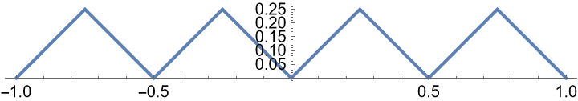

# 函数项级数
函数项级数的性质与[[数项级数]]的性质是有所不同的，函数项级数的研究实际上是为了进一步探究极限运算之间和其他种类的运算之间能不能**交换顺序**。

## 函数列的一致收敛性
### 逐点收敛
>[!note] 定义：逐点收敛
>设函数列 $\{f_n(x)\}$ 定义在数集 $X\subseteq \mathbb{R}$ ，点 $x_0\in X$ ，若数列 $\{f_n(x_0)\}$ 收敛，就称函数列 $\{f_n(x)\}$ 在 $x_0$ 处收敛，$X$ 中使函数列 $\{f_n(x)\}$ 收敛的全体元素 $x_0$ 的组成的集合 $A$ ，称为函数列 $\{f_n(x)\}$ 的**收敛域**。
>对于 $X$ 的一个子集 $A$ ，设 $f(x)$ 是定义在 $A$ 上的函数，若对每个 $x_0\in A$ ，数列 $\{f_n(x_0)\}$ 都收敛到 $f(x_0)$ ，就称函数列 $\{f_n(x)\}$ 在 $A$ 上**逐点收敛**。称 $f(x)$ 为函数列在 $A$ 上的**极限函数**。

对于极限函数有如下的式子：
 $$ 
\lim_{n\to \infty}f_n(x)=f(x)
 $$ 
那么这就让我们猜想能否通过 $f_n(x)$ 的极限、求导、积分来研究 $f(x)$ 的极限、求导、积分。这涉及到与 $\displaystyle\lim_{n\to\infty}$ 这个运算符交换次序的问题。

首先，我们要明确的是，在一般的情况下，上面的换序都是可能无法成立的，例如对函数 $f_n(x)=x^n$ ，当 对 $n$ 取极限时，我们可以发现：
 $$ 
f(x)=\lim_{n\to\infty}f_n(x)=\begin{cases}0 ,0\leq x<1 \\\\
1,x=1\end{cases}
 $$ 
极限函数 $f(x)$ 在 $x=1$ 处不连续，但 $f_n(x)$ 是连续的，这就说明
 $$ 
\lim_{x\to 1^-}\lim_{n\to \infty}f_n(x)\neq \lim_{n\to \infty}\lim_{x\to 1^-}f_n(x)
 $$ 
也就是换序不成立。对于积分也同样有类似的例子。

----
如果用 $\varepsilon-N$ 语言来阐述定义，可写为：对每个 $x\in X$ 和任意 $\varepsilon>0$ 都存在正整数 $N=N(x,\varepsilon)$ 使得当 $n>N$ 的时候都成立：
 $$ 
|f_n(x)-f(x)|<\varepsilon
 $$ 
这里的 $N$ 实际上表示既和 $x$ 有关又和 $\varepsilon$ 有关。

但是，正如我们想研究的最开始的问题，假如说我们能让 $N$ 与 $x$ 无关，换句话说就是与 $x$ 无关的“一致”的 $N=N(\varepsilon)$ ，那么下面可以引入一致收敛的定义。

### 一致收敛
>[!note] 定义：一致收敛
>设函数列 $\{f_n(x)\}$ 和函数 $f(x)$ 都在数集 $X$ 上有定义，若对任意 $\varepsilon>0$ ，都存在正整数 $N=N(\varepsilon)$ ，使得当 $n>N$ 的时候对每个 $x\in X$ 都成立：
> $$ |f_n(x)-f(x)|<\varepsilon $$ 则称 $\{f_n(x)\}$ 在 $X$ 上一致收敛到 $f(x)$，记为
> $$ f_n(x)\stackrel{X}{\rightrightarrows}f(x)\quad(n\to \infty). $$  
>如果不强调 $X$ 也可直接写 $\rightrightarrows$ .

定义直接证明并不方便判断，因此考虑用等价的定义，先引入函数间距离的概念：
>[!note] 定义：函数距离
>设 $g(x)$ 和 $h(x)$ 为定义在数集 $X$ 上的两个函数，记
> $$ ||g-h||=\sup_{x\in X}|g(x)-h(x)| $$ 
>为 $g(x)$ 与 $h(x)$ 的**距离**。

>[!note] 定理：一致收敛的等价定义（充要条件）
>设函数列 $\{f_n(x)\}$ 和 $f(x)$ 在数集 $X$ 上均有定义，则 $f_n(x)\rightrightarrows f(x)\  (n\to \infty)$ 的充要条件是
> $$ \lim_{n\to \infty}||f_n(x)-f(x)||=0 $$ 

证明直接利用 $\varepsilon$ 语言放缩即可。

下面给出例题以熟悉方法：
>[!faq] 例题1
>设  $$ f(x)=\begin{cases}0,0\leq x<1 \\\\ 1,x=1\end{cases} $$ 
>且 $f_n(x)=x^n,n=1,2,\cdots,$ ，证明：$\{f_n(x)\}$ 在区间 $[0,1]$ 上逐点收敛到 $f(x)$ ，但并非一致收敛。

逐点收敛显然，对于一致收敛：
(1) 使用定义的证法：
取 $x_n=\displaystyle\left(\frac{1}{2}\right)^{\frac{1}{n}}$ ，那么有：
 $$ 
|f_n(x_n)-f(x_n)| = |x_n^n-0|=\frac{1}{2}>\frac{1}{3}
 $$ 
现在取 $\varepsilon=\displaystyle\frac{1}{3}$ ，那么对于任意正整数 $N$ 都存在 $n>N$ 使得 $|f_n(x_n)-f(x_n)|\geq \varepsilon$ ，通过定义可知非一致收敛。

(2) 使用距离的证法：
考虑距离：
 $$ 
||f_n-f||=\sup_{0\leq x<1}|x^n|=1\nrightarrow 0
 $$ 
从而由充要条件可知在区间 $[0,1]$ 上非一致收敛。

### 一致收敛函数列的性质
#### 运算与复合
>[!example] 一致收敛函数列的运算性质
>- 两个一致收敛的函数列的线性组合仍一致收敛，且收敛到原结果的线性组合；
>- 一致收敛函数列的数乘也一致收敛，收敛到原结果的数乘；

>[!example] 一致收敛函数列的乘积与商
>- 若函数 $f(x)$ 在 $X$ 上**有界**，$\{g_n(x)\}$ 在 $X$ 上一致收敛到 $g(x)$ ，则 $\{f(x)g_n(x)\}$ 在 $X$ 上也一致收敛到 $f(x)g(x)$ .
>- 设函数列 $\{f_n(x)\},\{g_n(x)\}$ 在 $X$ 上分别一致收敛到 $f(x)$ 和 $g(x)$ ，若 $f(x)$ 和 $g(x)$ 都在 $X$ 上**有界**，则 $\{f_n(x)g_n(x)\}$ 在 $X$ 上一致收敛到 $f(x)g(x)$ .
>- 设函数列 $\{f_n(x)\},\{g_n(x)\}$ 在 $X$ 上分别一致收敛到 $f(x)$ 和 $g(x)$ . 若 $f(x)$ 在 $X$ 上有界，且存在 $\delta>0$ 使得 $|g(x)|\geq \delta (\forall x\in X)$，则 $\displaystyle\left\{\frac{f_n(x)}{g_n(x)}\right\}$ 在 $X$ 上一致收敛到 $\displaystyle\frac{f(x)}{g(x)}$ .


上述性质可利用 $\varepsilon$ 语言放缩证明，在此略过，可以参考教材。

需要注意的是性质中有界性是十分必要的，这也就是说如果无界，一致收敛将不能成立。可用 $f_n(x)=f(x)=\displaystyle\frac{1}{x}$ 和 $g(x)=x$ 在区间 $(0,1]$ 上的情形作为反例。

>[!example] 复合函数的一致收敛
>设函数列 $\{g_n(x)\}$ 在 $X$ 上一致收敛到 $g(x)$ ，函数 $\varphi(u)$ 在区间 $I$ 上**一致连续**，且对任意 $x\in X$ 成立 $g_n(x)\in I,g(x)\in I$ 则函数列 $\{\varphi(g_n(x))\}$ 在 $X$ 上一致收敛到 $\varphi(g(x))$ .

注意：该性质中的一致连续不可减弱为连续。

#### Cauchy收敛原理
>[!note] 定理：Cauchy收敛原理
>函数列 $\{f_n(x)\}$ 在 $X$ 上一致收敛的充要条件是对于 $\forall \varepsilon>0$ 都存在正整数 $N=N(\varepsilon)$ 使得当 $n>N$ 的时候对任意自然数都能成立：
> $$ |f_{n+p}(x)-f_n(x)|<\varepsilon\ (\forall x\in  X) $$ 

和往常的 Cauchy 收敛准则类似，我们同样要注意它在定理证明题当中的应用，尤其是判断一致收敛性的时候。

#### 一致有界
>[!note] 定义：一致有界
>若存在 $L>0$ 使得对任意正整数 $n$ 和每个 $x\in X$ 都有 $|f_n(x)|\leq L$ 则称函数列 $\{f_n(x)\}$ 在 $X$ 上**一致有界**。

>[!warning] 一致有界 $\neq$ 都有界
>每个函数 $f_n(x)$ 在 $X$ 上有界不代表 $\{f_n(x)\}$ 在 $X$ 上**一致有界**. 事实上，每个函数的界越来越大的情况下就不能保证一致有界。

为了解决“一致有界”和“都有界”之间的一个桥梁问题，有如下命题：
>[!note] 一致收敛 + 都有界 $\to$ 一致有界
>若函数列 $\{f_n(x)\}$ 在 $X$ 上**一致收敛**到 $f(x)$ 且每个 $f_n(x)$ 都在 $X$ 上有界，则 $\{f_n(x)\}$ 在 $X$ 上一致有界，且 $f(x)$ 也是有界函数.


#### Dini定理
>[!note] 定理：Dini定理
>若在闭区间 $[a,b]$ 上**连续函数列** $\{f_n(x)\}$ **逐点收敛到连续函数** $f(x)$ ，且对每个 $x_n\in [a,b]$，$\{f_n(x_0)\}$ 都是**单调数列**，则 $\{f_n(x)\}$ 在 $[a,b]$ 上**一致收敛**到 $f(x)$ .


## 一致收敛与极限换序
### 极限换序
#### 极限间换序
>[!note] 定理：极限运算换序
>若函数列 $\{f_n(x)\}$ 在区间 $(a,b)$ 上**一致收敛**到 $f(x)$ ，且对每个 $n$ 单侧极限 $\displaystyle\lim_{x\to a^+}f_n(x)=f_n(a+0)$ 都存在，则以下两个累次极限都存在且相等：
> $$ \lim_{x\to a^+}\lim_{n\to \infty}f_n(x)=\lim_{n\to \infty}\lim_{x\to a^+}f_n(x). $$  


>[!note] 推论：连续性
>设函数列 $\{f_n(x)\}$ 在区间 $I$ 上一致连续到 $f(x)$ ，若每个 $f_n(x)$ 都在 $I$ 上连续，则 $f(x)$ 也在 $I$ 上连续.


#### 积分与极限换序
>[!note] 积分与极限换序
>设函数列 $\{f_n(x)\}$ 在区间**一致收敛**到 $f(x)$ ，且每个 $f_n(x)$ 都在 $[a,b]$ 上可积，则 $f(x)$ 也在 $[a,b]$ 上可积，并且
> $$ \int_a^bf(x)\mathrm{d}x=\lim_{n\to \infty}\int_a^bf_n(x)\mathrm{d}x $$ 
>记 $F_n(x)=\displaystyle\int_a^x f_n(t)\mathrm{d}t$ ，则函数列 $\{F_n(x)\}$ 也在 $[a,b]$ 上**一致收敛**到 $F(x)=\displaystyle\int_a^x f(t)\mathrm{d}t$.


#### 求导与极限换序
>[!note] 定理：求导与极限换序
>设函数列 $\{f_n(x)\}$ 在某一点 $x_0\in [a,b]$ 处收敛，若每个 $f_n(x)$ 都在 $[a,b]$ 上可导，且 $\{f'_n(x)\}$ 在 $[a,b]$ 上**一致收敛**，设其极限为 $f(x)$ 则有
> $$ f'(x)=\lim_{n\to \infty}f'_n(x) $$ 


### 内闭一致收敛
>[!note] 定义：内闭一致收敛
>设 $\{f_n(x)\}$ 是定义在区间 $I$ 上的一列函数，如果对任何闭区间 $[a,b]\subseteq I$ ，$\{f_n(x)\}$ 都在 $[a,b]$ 上一致收敛，则称 $\{f_n(x)\}$ 在 $I$ 上**内闭一致收敛**。

内闭一致收敛比一致收敛较弱，在闭区间内，内闭一致收敛和一致收敛等价，对其他区间，内闭一致收敛要稍弱。


## 逼近定理
学习极限时，我们知道可以通过有理数序列来逼近无理数，例如 $q_n\to \sqrt{2}$ 可以通过以下的方法：
 $$ 
1,1.4,1.41,1.414,\cdots
 $$ 
同样地，能否用函数序列来逼近连续函数？首先由极限换序可知一致收敛的连续函数序列极限函数为连续函数。这个函数序列能否是多项式？连续函数是否总能表示成一致收敛的多项式极限？

>[!note] 引理
>对任意 $x$ 成立恒等式
> $$ \displaystyle\sum\limits_{k=0}^n \mathrm{C}^k_n (k-nx)^2x^k(1-x)^{n-k}=nx(1-x). $$ 

由二项式定理有

$$ 
\sum_{k=0}^n \mathrm{C}_n^k u^k v^{n-k}=(u+v)^n
$$ 

把 $v$ 看为参数，两边对 $u$ 求导，乘以 $u$ 可得
 $$ 
\sum\limits_{k=0}^n \mathrm{C}^k_nku^kv^{n-k}=nu(u+v)^{n-1}
 $$ 
重复操作：
 $$ 
\sum\limits_{k=0}^n \mathrm{C}^k_nk^2u^kv^{n-k}=nu(nu+v)(u+v)^{n-1}
 $$ 
从而对

$$ 
\begin{aligned}
&\sum_{k=0}^{n}\mathrm{C}_{n}^{k}(k-nx)^{2}u^{k}v^{n-k} \\\\
&=\sum_{k=0}^n\mathrm{C}_n^k(k^2-2nxk+n^2x^2)u^kv^{n-k} \\\\
&\begin{aligned}=\sum_{k=0}^n\mathrm{C}_n^kk^2u^kv^{n-k}-2nx\sum_{k=0}^n\mathrm{C}_n^kku^kv^{n-k}+n^2x^2\sum_{k=0}^n\mathrm{C}_n^ku^kv^{n-k}
\end{aligned} \\\\
&=nu(nu+v)(u+v)^{n-2}-2nx(nu)(u+v)^{n-1}+n^{2}x^{2}(u+v)^{n}.
\end{aligned}
$$ 

令 $u=x$ 且 $v=1-x$ ，于是 $u+v=1$ ，得到
 $$ 
\begin{aligned}
&\quad \sum_{k=0}^{n}\mathrm{C}_{n}^{k}(k-nx)^{2}x^{k}(1-x)^{n-k} \\\\
&=nx[nx+(1-x)]-2nx(nx)+n^2x^2  \\\\
&=nx(1-x).
\end{aligned}
 $$ 


>[!note] 定理：Weierstrass定理
>设 $f(x)$ 是闭区间 $[a,b]$ 上的连续函数，则对任意 $\varepsilon>0$ 都存在多项式 $P(x)$ 使得
> $$ ||f-P||=\displaystyle\max_{x\in [a,b]}|f(x)-P(x)|<\varepsilon. $$ 
>即：存在一列多项式 $\{P_n(x)\}$ 在 $[a,b]$ 上一致收敛到 $f(x)$ .

不妨设 $[a,b]=[0,1]$ ，令
 $$ 
B_n(x)=\sum_{k=0}^nf\left(\frac{k}{n}\right)\text{C}_n^kx^k(1-x)^{n-k}, n=1,2,\cdots.
 $$ 
其中 $B_n(x)$ 是一个 $n$ 次多项式，称为 $f(x)$ 的 $n$ 阶伯恩斯坦 (Bernstein) 多项式。

-----
证明： $\{B_n(x)\}$ 在 $[0,1]$ 上一致收敛到 $f(x)$ .

由二项式定理：

 $$ 
\sum\limits_{k=0}^n \mathrm{C}_n^k x^k(1-x)^{n-k}=1.
 $$ 

得到
 $$ 
f(x)=\sum\limits_{k=0}^n f(x)\mathrm{C}^k_n x^k(1-x)^{n-k}
 $$ 
那么
 $$ 
B_n(x)-f(x)=\sum_{k=0}^n\left[f\left(\frac{k}{n}\right)-f(x)\right]\text{C}_n^kx^k(1-x)^{n-k}.
 $$ 

由于 $f(x)$ 在 $[0,1]$ 上连续，因而**一致连续**，于是对于任意 $\varepsilon>0$ 存在 $\delta>0$ 当 $\displaystyle\left|\frac{k}{n}-x\right|<\delta$ ，总成立
 $$ 
\left|f\left(\frac{k}{n}\right)-f(x)\right|<\varepsilon
 $$ 

将 $\{0,1,\cdots,n\}$ 分为两个不相交的集合
$$ 
I_1 = \left\\{k\Bigg | \left|\frac{k}{n}-x\right|<\delta\right\\},I_2 = \left\\{k\Bigg | \left|\frac{k}{n}-x\right|\geq \delta\right\\}
$$ 

于是
 $$ 
|B_n(x)-f(x)|\leq \left(\sum\limits_{k\in I_1}+\sum\limits_{k\in I_2}\right)\left|f\left(\frac{k}{n}\right)-f(x)\right|\mathrm{C}^k_nx^k(1-x)^{n-k}
 $$ 

上式中的第一个和式可以利用一致收敛进行放缩。

第二个和式，当 $k\in I_2$ 时，由 $\displaystyle\left|\frac{k}{n}-x\right|\geq \delta$ ，我们有
 $$ 
\left(\frac{k-nx}{n \delta}\right)^2\geq 1.
 $$ 
由于 $f(x)$ 在 $[0,1]$ 上连续，因而有界，即存在 $M>0$ ，对每个 $x\in [0,1]$ 都成立 $|f(x)|\leq M.$ 于是

$$ 
\begin{aligned}
&\sum_{k\in I_{2}}\left|f\left(\frac{k}{n}\right)-f(x)\right|\mathrm{C}_{n}^{k}x^{k}(1-x)^{n-k} \\\\
&\leqslant2M\sum_{k\in I_{2}}\mathrm{C}_{n}^{k}x^{k}(1-x)^{n-k} \\\\
&\leqslant2M\sum_{k\in I_{2}}\mathrm{C}_{n}^{k}\left(\frac{k-nx}{n\delta}\right)^{2}x^{k}(1-x)^{n-k} \\\\
&\leqslant\frac{2M}{n^{2}\delta^{2}}\sum_{k=0}^{n}\mathrm{C}_{n}^{k}(k-nx)^{2}x^{k}(1-x)^{n-k} \\\\
&=\frac{2M}{n^2\delta^2}nx(1-x).
\end{aligned}
$$

当 $0\leq x\leq 1$ 时，可取 $N=\displaystyle\left[\frac{M}{2 \delta^2 \varepsilon}\right]$ .

当 $n>N$ 时总成立
 $$ 
\sum\limits_{k\in I_2}\left|f\left(\frac{k}{n}\right)-f(x)\right|\mathrm{C}_n^kx^k(1-x)^{n-k}\leqslant\varepsilon.
 $$ 

从而综上有
 $$ 
||B_n(x)-f(x)||\to 0 \quad (n\to \infty).
 $$ 
最后，对于任意区间 $[a,b]$ 令 $x=a+(b-a)t,\ t\in[0,1]$ 即可. 从而 Weierstrass 定理成立。

## 函数项级数的一致收敛
### 概念和极限换序
#### 函数项级数
>[!note] 定义：函数项级数
>设 $\{u_n(x)\}$ 是定义在数集 $X$ 上的一列函数，我们称
> $$ \displaystyle\sum\limits_{n=1}^\infty u_n(x)=u_1(x)+u_2(x)+\cdots+u_n(x)+\cdots $$ 
>为**函数项级数**，函数项级数与数项级数都可以简称为级数。

与数项级数一样，我们也称
 $$ 
S_n(x)=\sum\limits_{k=1}^n u_k(x)
 $$ 
为级数 $\displaystyle\sum\limits_{n=1}^\infty u_n(x)$ 的部分和，同样，函数项级数也有逐点收敛和一致收敛的概念，此时的序列是部分和序列 $\{S_n(x)\}$ . $\{S_n(x)\}$的极限函数为函数项级数的和函数，记为
 $$ 
\displaystyle\sum\limits_{n=1}^\infty u_n(x)=S(x)=\lim_{n\to \infty}S_n(x).
 $$ 
#### 函数项级数的性质
>[!note] 定理：逐项极限
>设函数项级数 $\displaystyle\sum\limits_{n=1}^\infty u_n(x)$ 在区间 $(a,b)$ 上一致收敛到 $S(x)$ ，且对于每个 $n$ ，单侧极限 $\displaystyle\lim_{x\to a^+}u_n(x)$ 都存在，则 $\displaystyle\lim_{x\to a^+}S(x)$ 也存在，此时可以逐项求极限：
> $$ \lim_{x\to a^+}\displaystyle\sum\limits_{n=1}^\infty u_n(x)=\displaystyle\sum\limits_{n=1}^\infty [\lim_{x\to a^+}u_n(x)]. $$ 


这个性质是一致收敛的一个必要条件，可以用来简单判别是否不一致收敛。

例如级数 $\displaystyle\sum\limits_{n=1}^\infty \frac{1}{n^x}$ ，单侧极限$\displaystyle\lim_{x\to 1^+}\frac{1}{n^x}=\frac{1}{n}$ 都存在，但是 $\displaystyle\sum\limits_{n=1}^\infty\lim_{x\to 1^+} \frac{1}{n^x}=+\infty$ ， 因此非一致收敛。

>[!note] 性质：内闭一致收敛 $\to$ 连续
>设函数项级数 $\displaystyle\sum\limits_{n=1}^\infty u_n(x)$ 在区间 $I$ 上内闭一致收敛到 $S(x)$ ，若每个 $u_n(x)$ 都在 $I$ 上连续，则 $S(x)$ 也在 $I$ 上连续。

>[!note] 一致收敛 $\to$ 积分可换
>设函数项级数 $\displaystyle\sum\limits_{n=1}^\infty u_n(x)$ 在区间 $I$ 上一致收敛到 $S(x)$，若每个 $u_n(x)$ 都在 $I$ 上可积，则 $S(x)$ 也在 $I$ 上可积，并且可以如下逐项求积分
> $$ \int_a^b \displaystyle\sum\limits_{n=1}^\infty u_n(x)\mathrm{d}x=\displaystyle\sum\limits_{n=1}^\infty \int_a^b u_n(x)\mathrm{d}x $$ 
>进而有 $\displaystyle\sum\limits_{n=1}^\infty \int_a^x u_n(t)\mathrm{d}t$ 也在 $[a,b]$ 上一致收敛到 $\displaystyle\int_a^x S(t)\mathrm{d}t.$

>[!note] 定理：逐项求导
>若函数项级数 $\displaystyle\sum\limits_{n=1}^\infty u_n(x)$ 满足：
>1. 在某个点 $x_0\in I$ 处收敛.
>2. 每个 $u_n(x)$ 在 $I$ 上可导；
>3. $\displaystyle\sum\limits_{n=1}^\infty u_n'(x)$ 在 $I$ 上内闭一致收敛；
> 
> 则$\displaystyle\sum\limits_{n=1}^\infty u_n(x)$ 在 $I$ 上也内闭一致收敛，并且可以如下逐项求导：
>  $$ \left[\displaystyle\sum\limits_{n=1}^\infty u_n(x)\right]'=\displaystyle\sum\limits_{n=1}^\infty u_n'(x). $$ 


### 一致收敛级数的判别法
#### Cauchy收敛原理
>[!note] 定理：Cauchy收敛原理
>函数项级数 $\displaystyle\sum\limits_{n=1}^\infty u_n(x)$ 在 $X$ 上一致收敛的充要条件是：对任意 $\varepsilon>0$ 都存在正整数 $N=N(\varepsilon)$ 使得当 $n>N$ 时对任意正整数 $p$ 都成立
> $$ |u_{n+1}(x)+\cdots+u_{n+p}(x)|<\varepsilon \ (\forall x\in  X) $$ 
>或者
> $$ ||u_{n+1}+\cdots+u_{n+p}||<\varepsilon. $$ 

利用 Cauchy 收敛原理可以获得一个推论：

>[!note] 推论1
>若函数项级数 $\displaystyle\sum\limits_{n=1}^\infty u_n(x)$ 在 $X$ 上一致收敛，则
> $$ ||u_n||\to 0\ (n\to \infty) $$ 

例如函数项级数 $\displaystyle\sum\limits_{n=1}^\infty n \mathrm{e}^{-nx}$ 在 $(0,+\infty)$ 上非一致收敛. 考虑
 $$ 
||n \mathrm{e}^{-nx}||=\sup_{x>0}\left|\frac{n}{\mathrm{e}^{nx}}\right| = n\not\to 0
 $$ 
从而得证。

#### Weierstrass 判别法
>[!note] 定理：Weierstrass判别法（优势判别法、$M$ - 判别法）
>设正项级数 $\displaystyle\sum\limits_{n=1}^\infty M_n$ 收敛，且 $n$ 充分大时成立
> $$ |u_n(x)|\leq M_n, \forall x\in  X $$ 
>则函数项级数 $\displaystyle\sum\limits_{n=1}^\infty u_n(x)$ 在 $X$ 上一致收敛.

>[!faq] 例题
>若级数 $\displaystyle\sum\limits_{n=1}^\infty a_n$ 绝对收敛，则 $\displaystyle\sum\limits_{n=1}^\infty a_n \sin(nx)$ 和 $\displaystyle\sum\limits_{n=1}^\infty a_n\cos(nx)$ 都在 $(-\infty,+\infty)$ 内既绝对收敛，又一致收敛。

#### A-D判别法
>[!note] 定理：Abel 判别法
>设在 $X$ 上，
>1. $\displaystyle\sum\limits_{n=1}^\infty \beta_n(x)$ 一致收敛；
>2. $\{\alpha_n(x)\}$ 一致有界，且对每个 $x\in X$ 都有数列 $\{\alpha_n(x)\}$ 单调；
>
>则 $\displaystyle\sum\limits_{n=1}^\infty \alpha_n(x)\beta_n(x)$ 在 $X$ 上一致收敛.


>[!note] Dirichlet判别法
>设在 $X$ 上：
>1. 部分和 $B_n(x)=\displaystyle\sum\limits_{k=1}^n \beta_k(x)$ 一致有界；
>2. $\{\alpha_n(x)\}$ 一致收敛到 $0$ 且对每个 $x$ ， $\{\alpha_n(x)\}$ 均单调；
>
>则 $\displaystyle\sum\limits_{n=1}^\infty \alpha_n(x)\beta_n(x)$ 在 $X$ 上一致收敛.

### 级数形式的Dini定理
>[!note] 定理：Dini定理（级数形式）
>设函数列 $\{u_n(x)\}$ 在闭区间 $[a,b]$ 上连续，若函数项级数 $\displaystyle\sum\limits_{n=1}^\infty u_n(x)$ 逐点收敛到连续函数 $S(x)$ ，且对每个 $x_0\in [a,b]$ 数列 $\{u_n(x_0)\}$ 都不变号，则 $\displaystyle\sum\limits_{n=1}^\infty u_n(x)$ 在 $[a,b]$ 上一致收敛到 $S(x)$ .
>


## 利用函数项级数构造特殊函数
### 处处连续又处处不可微函数
定义函数
 $$ 
u_0(x) = 
\begin{cases} 
 x-2n, 2n\leq x\leq 2n+1, \\\\
2n-x,2n-1\leq x\leq 2n,
\end{cases}
\quad n=0,\pm 1,\cdots
 $$ 

利用如下代码可在 Mathematica 当中绘图：
```mathematica
f[x_] := 
 Piecewise[{{x - Floor[x], 0 <= Mod[x, 2] < 1}, {-x + Floor[x] + 1, 
    1 <= Mod[x, 2] < 2}}]

Manipulate[
 Plot[f[4^a x]/(4^a), {x, -1, 1}, AspectRatio -> Automatic], {a, 0, 
  10}]
```




这个函数是初等函数，现在，令
 $$ 
u_n(x) = \frac{u_0(4^nx)}{4^n},\quad n=1,2,\cdots
 $$ 

下面我们断言：对于上述函数的无穷函数项级数
 $$ 
f(x) = \displaystyle\sum\limits_{n=0}^\infty u_n(x)
 $$ 
该函数处处连续，但又处处不可微。

首先，由于 $|u_n(x)|\leq 4^{-n}$ 可根据优势判别法，级数 $\displaystyle\sum\limits_{n=0}^\infty u_n(x)$ 在 $(-\infty,+\infty)$ 上一致收敛，所以 $f(x)$ 在 $(-\infty,+\infty)$ 上连续。

下面证明其处处不可微，任取一点 $x_0\in (-\infty,+\infty)$ ，总能找到一列区间
 $$ 
I_n = \left[\frac{s_n-1}{4^n},\frac{s_n}{4^n}\right],s_n\in \mathbb{Z},n=0,1,\cdots
 $$ 
使得
 $$ 
x_0\in I_{n+1}\subseteq I_n ,n=0,1,2,\cdots
 $$ 
由于每个区间长度为 $4^{-n}$ ，总能找到一点 $x_n$ 满足
 $$ 
|x_n-x_0|=\frac{2}{4^{n+1}},n=1,2,3,\cdots
 $$ 
一方面，当 $k>n$ 时，由于 $u_k(x)$ 的周期为 $\displaystyle\frac{2}{4^k}$ ，而 $\displaystyle\frac{2}{4^{n+1}}$ 是它的的整数倍，所以 $u_k(x_n)=u_k(x_0)$ ；

另一方面，对于 $k\leq n$ ，由于 $x_0,x_n\in I_n\subseteq I_k$ ，而 $u_k$ 在 $I_k$ 上是线性函数且斜率为 $\pm 1$ ，这样我们得到
 $$ 
\begin{aligned}
\frac{f(x_n)-f(x_0)}{x_n-x_0} &= \displaystyle\sum\limits_{n=0}^\infty\frac{u_k(x_n)-u_k(x_0)}{x_n-x_0} \\\\ 
&= \sum\limits_{k=0}^n \frac{u_k(x_n)-u_k(x_0)}{x_n-x_0} \\\\
&=\sum\limits_{k=0}^n (\pm1)
\end{aligned}
 $$ 

最后的结果在 $n$ 奇偶性不同的时候会出现不同的结果，这就导致 $n\to \infty$ 时极限不存在，从而不可微。

### 在给定的一列点上导函数不连续的函数

从如下函数开始构造：
 $$ 
u(x) = 
\begin{cases}\displaystyle\frac{x^2}{1+x^2}\sin \frac{1}{x}, &x\neq 0 \\\\ 0,  &x=0\end{cases}
 $$ 
易知处处可微，但是求导后有
 $$ 
u'(x)=
\begin{cases}\displaystyle\frac{2x}{(1+x^2)^2}\sin \frac{1}{x}-\frac{1}{1+x^2}\cos \frac{1}{x},&x\neq 0,  \\\\ 0,&x=0.\end{cases}
 $$ 

此时发现 $u'(x)$ 在 $x=0$ 点不连续，注意到当 $x\neq 0$ 时，
 $$ 
\left|x\sin\frac{1}{x}\right|=\frac{\displaystyle\left|\sin\frac{1}{x}\right|}{\left|\displaystyle\frac{1}{x}\right|}\leq 1
 $$ 
所以
 $$ 
|u(x)|\leq 1, \ |u'(x)|\leq 2\left|x\sin \frac{1}{x}\right|+\left|\cos \frac{1}{x}\right|\leq 3
 $$ 
现在设给定的一列实数点为 $\{p_n\}$ ，定义
 $$ 
u_n(x)=\frac{1}{2^n}u(x-p_n), f(x)=\displaystyle\sum\limits_{n=1}^\infty u_n(x)
 $$ 
根据优势判别法可知 $f(x)$ 在 $(-\infty,+\infty)$ 上一致收敛，而我们可以断言，上述的 $f(x)$ 的导数 $f'(x)$ 所有不连续点恰好是 $x=p_n,n=1,2,\cdots$ .

