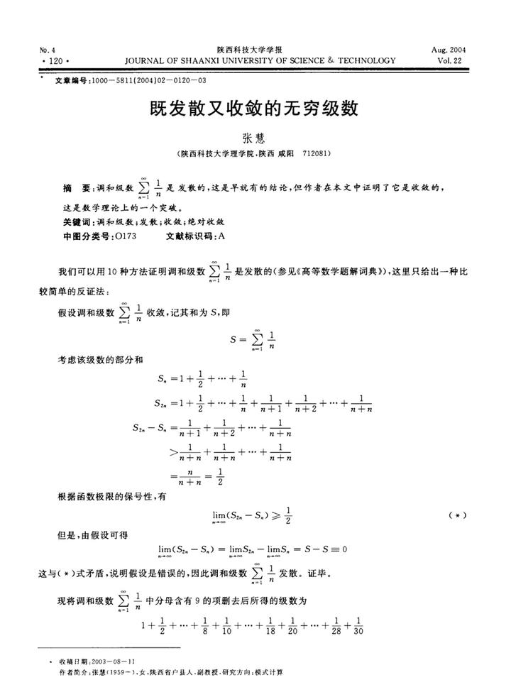
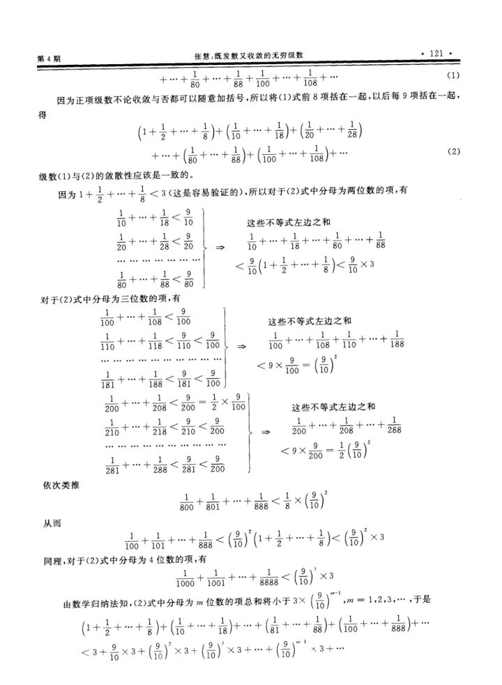
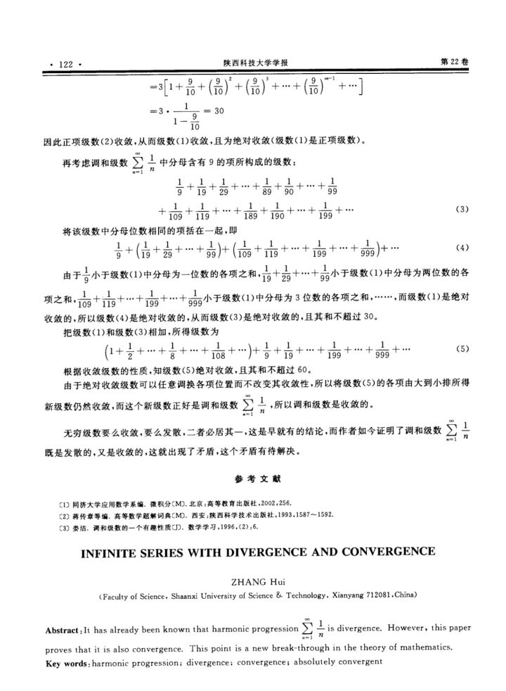

# 数项级数

## 级数
>[!note] 定义：级数
>我们把无穷多项相加的表达式
> $$ \sum\limits_{n=1}^n=u_1+u_2+\cdots+u_n+\cdots $$ 
>称为一个**无穷级数**，简称**级数**。

## 级数的收敛性和基本性质
### 级数通项和部分和
设级数 $\displaystyle\sum\limits_{n=1}^\infty u_n$ 为一个级数，称 $u_n$ 为级数的**通项**。且

$$
S_n=\sum\limits_{i=1}^nu_k=u_1+\cdots+u_n
$$

为级数的第 $n$ 个部分和，并称数列 $\{S_n\}$ 为级数 $\displaystyle\sum\limits_{n=1}^\infty u_n$ 为级数的部分和数列。

### 级数收敛及其性质

>[!note] 定义：级数收敛性
>如果级数 $\displaystyle\sum\limits_{n=1}^\infty u_n$ 的相应部分和数列 $\{S_n\}$ 收敛，则称级数 $\displaystyle\sum\limits_{n=1}^\infty u_n$ **收敛**，并把极限 $\displaystyle\lim_{n\to\infty}S_n=S$ 称为级数的和，记为
>$$ \sum\limits_{n=1}^\infty u_n=\lim_{n\to\infty}S_n=S. $$ 
>如果数列发散，则称级数**发散**。

>[!note] 性质：级数收敛的必要条件
>若级数 $\displaystyle\sum\limits_{n=1}^\infty u_n$ 收敛，则其通项 $u_n$ 收敛于**0**，即有
> $$ \lim_{n\to\infty}u_n=0 $$ 

需要注意的是这个仅仅只是必要条件而非充要条件，调和级数就是典型的反例。

利用数列极限的Cauchy收敛原理即有级数的Cauchy收敛原理：

>[!note] 定理：级数的Cauchy收敛原理
>级数 $\displaystyle \sum\limits_{n=1}^\infty u_n$ 收敛的充要条件是：对任何 $\varepsilon>0$ ，存在正整数 $N>0$ 使得对一切 $n>N$ 以及任何正整数 $p$ 都有
> $$ |S_{n+p}-S_p|=|u_{n+1}+\cdots+u_{n+p}|<\varepsilon $$ 

下面利用Cauchy收敛原理证明调和级数发散。

>[!faq] 例题：证明调和级数发散
>证明调和级数$\displaystyle\sum\limits_{n=1}^\infty\frac{1}{n}$发散.

取正整数 $p=n$ ，那么有
 $$ 
\begin{aligned}
|S_{2n}-S_n|&=\left|\frac{1}{n+1}+\cdots+\frac{1}{2n}\right|\\\\
&>n\times\frac{1}{2n}=\frac{1}{2}
\end{aligned}
 $$ 

根据Cauchy收敛原理知调和级数发散。

提起调和级数有一个乐子论文可以放在这里：

可以说是数学人必读的乐子论文🤣。（虽然已经很老了）

这篇论文里的最大笑话其实来自于作者最后对分母含有9的项所构成的级数敛散性的判断，因为当位数逐渐增大的时候，分母含有9的项的比例实际上是**越来越大的**，当位数为 $n$ 时，分母含有9的概率为 $\displaystyle1-\left(\frac{8}{9}\right)^n$ ，这就导致在后面位数增长的时候几乎所有项的分母都会包含9. 当然这只是一个直观理解，而非严格的证明。

那么这个问题其实很有意思，调和级数中所有**不包含**数字 $9$ 的项构成的级数是否收敛？这个级数实际上早有研究，名为**Kempner级数**，它是收敛的，而且目前仍在探索收敛结果最佳的估计。
## 级数求和问题
这个部分就是考察高中的基本功了，利用高中的方法即可，**裂项相消**在这个部分就是通法，后续学到更高级的方法的时候再做讨论。

>[!faq] NKU练习14.1(2)
>求下列级数的和：
> $$ \sum\limits_{n=1}^\infty\frac{2n-1}{2^n} $$ 

这个级数可以非常轻松的裂项：
 $$ 
\sum\limits_{n=1}^\infty \left(\frac{-2(n+1)-1}{2^n}-\frac{-2n-1}{2^{n-1}}\right)
 $$ 
在高中没有出现过的反三角函数求和也可以使用裂项相消的方法进行求和。以下是几个常用的公式：
>[!example] 反正切函数求和的几个裂项公式
>- $\displaystyle\arctan(n+1)-\arctan(n) = \frac{1}{n^2+n+1}$
>- $\displaystyle\arctan\left(\frac{1}{2n-1}\right)-\arctan\left(\frac{1}{2n+1}\right)=\arctan\left(\frac{1}{2n^2}\right)$
>- $\displaystyle\arctan\left(\frac{1}{n-1}\right)-\arctan\left(\frac{1}{n+1}\right)=\arctan\left(\frac{2}{n^2}\right)$

## 正项级数
### 正项级数的定义

>[!note] 定义：正项级数
>所有项均为**非负项**的级数叫**正项级数**。

正项级数的定义比较简单，在此不赘述。对于正项级数，由于每一项均为非负数，所以部分和随着项增多是单调递增的。所以我们有如下的性质：

>[!note] 定理：正项级数收敛的充要条件
>正项级数收敛的充分必要条件是它的部分和数列为有界数列。

### 判别法总结
#### 比较判别法
利用上述的充要条件，我们可以有正项级数的**比较判别法**：
>[!note] 定理：比较判别法
>设 $\displaystyle\sum\limits_{n=1}^\infty u_n$ 和 $\displaystyle\sum\limits_{n=1}^\infty v_n$ 为两个正项级数，且存在正整数 $N$ 使得 $n\geq N$ 的时候总有 $u_n\leq v_n$ ，则有如下的结论：
>1. 若级数 $\displaystyle\sum\limits_{n=1}^\infty v_n$ 收敛，则级数 $\displaystyle\sum\limits_{n=1}^\infty u_n$ 也收敛；
>2. 若级数 $\displaystyle\sum\limits_{n=1}^\infty u_n$ 发散，则级数 $\displaystyle\sum\limits_{n=1}^\infty v_n$ 也发散。

总结起来就一句话：**若大和收敛则小和收敛，若小和发散则大和发散**。
如果能选择正确的级数进行比较，那么比较判别法常常能有比较好的效果。接下来的判别法也主要是基于比较的判别法，这些判别法取的一般是比较特别的级数。

#### 达朗贝尔比值判别法
上面的比较判别法如果使用几何级数 $\displaystyle\sum\limits_{n=1}^\infty q^n$ 进行比较，可以得到达朗贝尔比值判别法：
>[!note] 定理：达朗贝尔（比值）判别法
>设级数 $\displaystyle\sum\limits_{n=1}^\infty u_n$ 中 $u_n>0$ 恒成立，考虑 $\displaystyle D_n=\frac{u_{n+1}}{u_n}$：
>1. 若存在 $0<q<1$ 以及正整数 $N$ 使得当 $n\geq N$ 时有 $D_n\leq q$，则级数 $\displaystyle\sum\limits_{n=1}^\infty u_n$ 收敛；
>2. 若存在正整数 $N$ 使得当 $n\leq N$ 时有 $D_n\geq 1$ ，则级数 $\displaystyle\sum\limits_{n=1}^\infty u_n$ 发散。

需要注意的是极限为 $1$ 的情况有可能收敛也有可能发散，不能判断敛散性。例如调和级数，$\displaystyle D_n=\frac{n}{n+1}<1$ ，无法找到一个 $q<1$ 使得 $D_n\leq q$ 对无穷项成立。

下面是达朗贝尔判别法的极限形式：

>[!note] 定理：达朗贝尔（比值）判别法极限形式
>当 $a_n>0(n=1,2,\cdots)$ 且 $\displaystyle\lim_{n\to\infty}\frac{a_{n+1}}{a_n}=q$，则有
>1. 当 $\displaystyle\varlimsup_{n\to\infty}D_n<1$ 时级数收敛；
>2. 当 $\displaystyle\varliminf_{n\to\infty}D_n>1$ 时级数发散。

#### 柯西根值判别法
柯西判别法同样也是针对几何级数比较进行证明的，柯西判别法如下所示：

>[!note] 定理：柯西（根值）判别法
>设级数 $\displaystyle\sum\limits_{n=1}^\infty u_n$ 为正项级数且记 $C_n=\sqrt[n]{u_n}$，则有
>1. 若存在 $0<q<1$ 及正整数 $N$，使得当 $n\geq N$ 时有 $C_n\leq q$，则级数 $\displaystyle\sum\limits_{n=1}^\infty u_n$ 收敛；
>2. 若存在子列 $\{n_k\}$ 使得 $C_{n_k}\geq 1$ ，则级数 $\displaystyle\sum\limits_{n=1}^\infty u_n$ 发散；

>[!warning] 注：Cauchy判别法的优势
>达朗贝尔判别法、Raabe 判别法和 Gauss 判别法在判别的时候，或多或少都会要求级数的通项所成数列 $\{a_n\}$ 至少从某一项开始单调，但是柯西判别法并不受这个限制。

#### 柯西积分判别法

>[!note] 柯西积分判别法
>设函数 $f(x)$ 在区间 $[0,+\infty)$ 上非负且递减，$\displaystyle A_n=\int_{1}^nf(x)\mathrm{d}x$ ，那么级数 $\displaystyle\sum\limits_{n=1}^\infty f(n)$ 与数列 $\{A_n\}$ 的敛散性相同。
>也可直接描述为：
> $$ \displaystyle\sum\limits_{n=1}^\infty f(n)收敛(发散)\iff \int_1^{+\infty}f(x)\mathrm{d}x收敛(发散) $$ 

原理其实非常简单，积分值可以被两个级数夹逼，从而有
 $$ 
\sum\limits_{k=1}^n f(k)\leq \int_1^n f(x)\mathrm{d}x\leq \sum\limits_{k=2}^nf(k-1)
 $$ 

有了积分判别法，$p$ - 级数就能非常简单地判别敛散性了：

>[!faq] 例题：$p$ - 级数的敛散性
>讨论级数 $\displaystyle\sum\limits_{n=1}^{\infty}\frac{1}{n^p}(p>0)$ 的收敛性。

令 $\displaystyle f(x)=\frac{1}{x^n}$ ，当 $p=1$ 时有
 $$ 
A_n=\int_1^n\frac{\mathrm{d}x}{x}=\ln(n)\to +\infty
 $$ 
调和级数发散，利用比较判别法可知 $0<p<1$ 时也发散。

当 $p>1$ 时：
 $$ 
\begin{aligned}
A_n &= \int_1^n\frac{1}{x^p}\mathrm{d}x\\\\
&= -\frac{1}{(p-1)x^{p-1}}\Bigg|^n_1\\\\
&=-\frac{1}{(p-1)n^{p-1}}+\frac{1}{p-1}\to\frac{1}{p-1}
\end{aligned}
 $$ 
故 $p>1$ 时收敛。

#### 阶的估计法
有了 $p$ - 级数，回顾极限当中无穷小量的阶，如果我们可以比较出一个正项级数 $\displaystyle\sum\limits_{n=1}^\infty u_n$ 中通项 $u_n$ 与 $p$ - 级数通项的阶的大小关系，会得到什么样的结果？利用比较判别法我们可以得到如下的阶的估计法：

>[!note] 定理：阶的估计法（比较判别法II）
>设 $\displaystyle\sum\limits_{n=1}^\infty u_n$ 为正项级数，则：
>1. 若存在 $p>1$ 且存在正整数 $N$ 与正常数 $K$ ，使得 $\displaystyle u_n\leq \frac{K}{n^p}(n\geq N)$ ，则级数 $\displaystyle\sum\limits_{n=1}^\infty u_n$ 收敛；
>2. 若存在 $p\leq 1$ 且存在正整数 $N$ 与正常数 $K$ ，使得 $\displaystyle u_n\geq \frac{K}{n^p}(n\geq N)$ ，则级数 $\displaystyle\sum\limits_{n=1}^\infty u_n$ 发散；

#### 比值比较判别法
>[!note] 定理：比值比较判别法
>设级数 $\displaystyle\sum\limits_{n=1}^\infty u_n$ 和 $\displaystyle\sum\limits_{n=1}^\infty v_n$ 都是正项级数，且存在正整数 $N$ 使得当 $n\geq N$ 时，$u_n>0,v_n>0$ ，且有
> $$ \frac{u_{n+1}}{u_n}\leq \frac{v_{n+1}}{v_n} $$ 
>则
>1. 若 $\displaystyle\sum\limits_{n=1}^\infty v_n$ 收敛则 $\displaystyle\sum\limits_{n=1}^\infty u_n$ 也收敛；
>2. 若 $\displaystyle\sum\limits_{n=1}^\infty u_n$ 发散则 $\displaystyle\sum\limits_{n=1}^\infty v_n$ 也发散。

#### Raabe判别法
Raabe在不同的地方翻译不一样，教材翻译叫拉阿伯判别法，谢惠民上叫拉比判别法，在本笔记当中还是直接使用英文名以防混淆。（顺带一提个人觉得NKU教材翻译更土一点，还是喜欢后者）

>[!note] 定理：Raabe判别法
>设 $\displaystyle\sum\limits_{n=1}^\infty u_n$ 是正项级数且所有的项均为正数，记 $\displaystyle R_n=n\left(\frac{u_n}{u_{n+1}}-1\right).$
>1. 若存在 $q>1$ 及正整数 $N$ 使得当 $n\geq N$ 时有 $R_n\leq q$，则级数 $\displaystyle\sum\limits_{n=1}^\infty u_n$ 收敛；
>2. 若存在正整数 $N$ 使得当 $n\geq N$ 有 $R_n\leq 1$ 则级数 $\displaystyle\sum\limits_{n=1}^\infty u_n$ 发散。

Raabe判别法包含了达朗贝尔比值判别法，但是要更精细。其理由在于比较的级数为 $p$-级数，它比几何级数更加强力.

>[!note] 定理：Raabe判别法的极限形式
>若数列 $\{R_n\}$ 收敛，设 $\displaystyle\lim_{n\to \infty}R_n=r$ .
>1. 若 $r>1$ ，则级数 $\displaystyle\sum\limits_{n=1}^\infty u_n$ 收敛；
>2. 若 $r<1$ ，则级数 $\displaystyle\sum\limits_{n=1}^\infty u_n$ 发散；

#### Gauss判别法
>[!note] 定理：Gauss判别法
>设 $\sum\limits_{n=1}^\infty u_n$ 是正项级数，且所有的项都是正数，则
> $$ \frac{u_n}{u_{n+1}}=\lambda+\frac{\mu}{n}+\frac{\nu}{n\ln n}+o\left(\frac{1}{n\ln n}\right) $$ 
>则有
>1. 若 $\lambda>1$ 或者 $\lambda=1,\mu>1$ 或者 $\lambda=\mu=1,\nu>1$ ，则级数 $\displaystyle\sum\limits_{n=1}^\infty u_n$ 收敛；
>2. 若 $\lambda<1$ 或者 $\lambda=1,\mu<1$ 或者 $\lambda=\mu=1,\nu<1$ ，则级数 $\displaystyle\sum\limits_{n=1}^\infty u_n$ 发散.

Gauss判别法是目前学到的判别法中最强力的判别法，但是劣势显而易见：比较难算，而且上面的 Gauss 判别法实际上不够易用，下面的推论更常用：
>[!note] 推论
>若 $a_n>0$ 且 
> $$ \frac{a_n}{a_{n+1}} = \lambda+\frac{\mu}{n}+\frac{\theta_n}{n^{1+\varepsilon}} $$ 
>其中 $|\theta_n|<C,\varepsilon>0$ ，则有
>1. $\lambda>1$ 时级数收敛；
>2. $\lambda<1$ 时级数发散；
>3. 当 $\lambda=1$ 时，$\mu>1$ 时级数收敛，$\mu\leq 1$ 时级数发散.

### 收敛快慢
>[!note] 定义：收敛更慢
>设 $\displaystyle\sum\limits_{n=1}^\infty u_n$ 与 $\displaystyle\sum\limits_{n=1}^\infty u'_n$ 是两个收敛的正项级数且它们的所有项都是正数，把它们的余级数分别记为 $\gamma_n=\displaystyle\sum\limits_{k=n+1}^\infty u_k$ 与 $\gamma'_n=\displaystyle\sum\limits_{k=n+1}^\infty u_k'$. 如果 $\gamma_n'$ 是 $\gamma_n$ 的低阶无穷小，即
> $$ \lim_{n\to\infty}\frac{\gamma_n}{\gamma'_n}= 0 $$ 
>则称级数 $\displaystyle\sum\limits_{n=1}^\infty u_n'$ 比级数 $\displaystyle\sum\limits_{n=1}^\infty u_n$ **收敛更慢**.

需要注意的是收敛更慢 $\ne$ 收敛值更小，收敛的快慢不能判断收敛值的大小。

收敛的快慢可以用来解释先前的判别法中，为什么后面的判别法往往优于前面的判别法。

我们先来看四个判别法的原理：
- 同几何级数 $\displaystyle\sum\limits_{n=1}^\infty aq^{n-1}$ 比较的判别法：达朗贝尔判别法，柯西根值判别法；
- 同 $p$ - 级数比较的判别法：Raabe判别法；
- 同 $\displaystyle\sum\limits_{n=1}^\infty \frac{1}{n\ln^p n}(p>1)$ 进行比较的判别法：Gauss判别法.
以上的判别法都是基于比较的判别法，如果我们选取的**基准**级数收敛比较慢，那么**比它收敛更慢**的级数我们是可以探测到的，例如达朗贝尔判别法可以检测出所有比几何级数收敛更快的级数，但是 $p$ - 级数是在 $p>1$ 时收敛比几何级数更慢，这也就导致无法通过比较来判断是否收敛。

从而我们有一个结论，当我们选取的基准收敛越慢，判别法也会越来越精细。但是代价就是计算会更麻烦。

## 任意项级数
### 绝对收敛与条件收敛
>[!note] 定义：绝对收敛、条件收敛
>对于级数 $\displaystyle\sum\limits_{n=1}^\infty u_n$ 若级数 $\displaystyle\sum\limits_{n=1}^\infty |u_n|$ 收敛，则称级数 $\displaystyle\sum\limits_{n=1}^\infty u_n$ **绝对收敛**，若级数 $\displaystyle\sum\limits_{n=1}^\infty u_n$ 收敛而 $\displaystyle\sum\limits_{n=1}^\infty |u_n|$ 发散，则称级数 $\displaystyle\sum\limits_{n=1}^\infty u_n$ **条件收敛**。

利用绝对值不等式可以得到非常显然的结论：如果级数 $\displaystyle\sum\limits_{n=1}^\infty |u_n|$ 收敛，则 $\displaystyle\sum\limits_{n=1}^\infty u_n$ 一定收敛。

### 交错级数与Leibniz判别法
>[!note] 定义：交错级数
>正项和负项交错排列的级数称为交错级数，交错级数可写为 $\displaystyle\sum\limits_{n=1}^\infty (-1)^{n+1}u_n$ 或者 $\displaystyle\sum\limits_{n=1}^\infty (-1)^nu_n$ ，其中 $u_n\geq 0,n=1,2,\cdots$.

为了判断交错级数的敛散性，需要利用下面的引理来估计 Cauchy 收敛准则的部分和：
>[!note] 引理：交错级数部分和的估计
>设级数 $\displaystyle\sum\limits_{n=1}^\infty (-1)^{n+1}u_n$ 是交错级数，其中 $u_n\geq0$, $n=1,2,\cdots,$ 且数列 $\{u_n\}$ 递减，则对任何自然数 $n$ 和任何正整数 $p$ 有
> $$ \left|\sum\limits_{k=n+1}^{n+p}(-1)^{k+1}u_k\right|\leq u_{n+1}. $$ 

分情况计算即可，在此略过。

利用Leibniz判别法可以比较好地判断交错级数的敛散性，下面利用引理证明：
>[!note] 定理：Leibniz判别法
>设数列 $\{u_n\}$ 递减且收敛于0，则交错级数 $\displaystyle\sum\limits_{n=1}^\infty (-1)^{n+1}u_n$ 收敛。

因为 $\displaystyle\lim_{n\to\infty}u_n=0$ 故对任何的 $\varepsilon>0$ 存在正整数 $N$ 使得当 $n>N$ 时就有
 $$ 
0\leq u_n<\varepsilon.
 $$ 
于是由引理对任何正整数 $p$ 均有
 $$ 
\left|\sum\limits_{k=n+1}^{n+p}(-1)^{k+1}u_k\right|\leq u_{n+1}<\varepsilon.
 $$ 
由 Cauchy 收敛定理可知级数收敛。

我们将满足Leibniz判别法的交错级数 $\displaystyle\sum\limits_{n=1}^\infty (-1)^nu_n$ 或 $\displaystyle\sum\limits_{n=1}^\infty(-1)^{n+1}u_n$ 称为**Leibniz型级数**。

### Abel求和、引理和判别法
Abel求和是针对有穷多项求和：
 $$ 
S = \sum\limits_{k=1}^ma_kb_k
 $$ 
的一个初等求和法，令
 $$ 
B_j = \sum\limits_{k=1}^jb_k,\ j=1,2\cdots,m
 $$ 
于是 $b_1=B_1$ 且
 $$ 
b_k = B_k-B_{k-1} \ ,k=2,3,\cdots,m
 $$ 
记 $B_0 = 0$ ，则上式对 $k=1$ 也成立，进行拆分：
 $$ 
\begin{aligned}
S &= \sum\limits_{k=1}^m a_kb_k-\sum\limits_{k=1}^m a_k(B_k-B_{k-1})  \\\\
&= \sum\limits_{k=1}^m a_k B_k-\sum\limits_{k=2}^m a_k B_{k-1} 
\\\\
&=  a_mB_m+\sum\limits_{k=1}^{m-1}a_{k}B_k-\sum\limits_{k=1}^{m-1}a_{k+1}B_k \\\\
&=a_mB_m+\sum\limits_{k=1}^{m-1}(a_k-a_{k+1})B_k
\end{aligned}
 $$ 
最终结果就是 Abel 求和公式，它适用于 $B_k$ 比较容易求出的情形，一个比较典型的例子就是
 $$ 
\sum\limits_{k=1}^n (an+b)q^k
 $$ 
利用 Abel 求和的流程就是先计算等比数列的和，再根据 Abel 求和公式可以简单地求和了。

Abel 求和该怎么去简单记忆？或者说有没有更直观的理解？

从代数的层面上，Abel 求和公式实际上就是分部积分的一个离散版本。我们知道分部积分：
 $$ 
\int u \mathrm{d}v=uv-\int v \mathrm{d}u
 $$ 
实际上就是微分法则 $\mathrm{d}(uv)=u \mathrm{d}v+v \mathrm{d}u$ 的一个逆向应用。如果我们仿照这样的思路应用在离散情形，

从几何图形的层面上，它其实直观到令人难以置信：

我们来看长为 $a_k$ 宽为 $b_k$ 的长方形列，它们的面积之和就是我们想要的结果，现在来看横向切出来的部分，我们可以发现这就是 Abel 公式右式的结果（对照图片来看）.

有关更深层的应用：[什么是伯努利数？ - 知乎 (zhihu.com)](https://www.zhihu.com/question/319231555/answer/2659674593)

利用 Abel 求和公式可以证明如下的 Abel 引理：

>[!note] 定理：Abel引理
>如果有限数列 $\{a_1,a_2,\cdots,a_m\}$ 和 $\{b_1,b_2,\cdots,b_n\}$ 满足下列条件：
>1. 数列 $\{a_k\}$ 单调；
>2. $|B_k|\leq M,k=1,2,\cdots,m,$
>则有估计式
> $$ |S|=\left|\sum\limits_{k=1}^ma_kb_k\right|\leq M(|a_1|+2|a_m|). $$ 

证明：
由 Abel 求和公式有：
 $$ 
\begin{aligned}
|S|&\leq\sum\limits_{k=1}^{m-1} |a_k-a_{k-1}||B_k|+|a_mB_m|\\\\
&\leq M\left(\sum\limits_{k=1}^{m-1}|a_k-a_{k+1}|+|a_m|\right)
\end{aligned}
 $$ 
因为 $\{a_k\}$ 单调，故所有的 $(a_k-a_{k-1}),(k=1,2,\cdots,m-1)$ 都同号，从而
 $$ 
\begin{aligned}
|S|&\leq M\left(\sum\limits_{k=1}^{m-1}|a_k-a_{k-1}|+|a_m|\right)  \\\\
&= M(|a_1-a_m|+|a_m|)\leq M(|a_1|+2|a_m|)
\end{aligned}
 $$ 

有了 Abel 引理，可以推导得出 Abel 判别法：
>[!note] 定理：Abel判别法
>设级数 $\displaystyle\sum\limits_{n=1}^\infty a_nb_n$ 满足下列条件：
>1. 级数 $\displaystyle\sum\limits_{n=1}^\infty b_n$ **收敛**；
>2. 数列 $\{a_n\}$ **单调有界**，
>
>则级数 $\displaystyle\sum\limits_{n=1}^\infty a_nb_n$ 收敛.

由 Cauchy 收敛准则可得
 $$ 
\left|\sum\limits_{k=n+1}^{n+p} b_k\right|<\varepsilon
 $$ 
由 Abel 引理可知
 $$ 
\left|\sum\limits_{k=n+1}^{n+p}a_kb_k\right|\leq \varepsilon(|a_{n+1}|+2|a_{n+p}|)\leq 3M \varepsilon
 $$ 
故由 Cauchy 收敛准则知收敛. $\rule{3pt}{10pt}$

### Dirichlet判别法
>[!note] 定理：Dirichlet判别法
>设级数 $\displaystyle\sum\limits_{n=1}^\infty a_nb_n$ 满足下列条件：
>1. 级数 $\displaystyle\sum\limits_{n=1}^\infty b_n$ 的部分和数列 $\{B_n\}$ 有界；
>2. 数列 $\{a_n\}$ 单调趋于0.
>
>则级数 $\displaystyle\sum\limits_{n=1}^\infty a_nb_n$ 收敛.

证明：
因为 $\{B_n\}$ 有界，所以存在常数 $M>0$ 使得 $|B_n|\leq M$ ，于是对任何正整数 $n$ 和 $p$ 都有：
 $$ 
\left|\sum\limits_{k=n+1}^{n+p}b_k\right| = |B_{n+p}-B_n|\leq 2M.
 $$ 
又因 $\{a_n\}$ 趋于 0， 故对任意给的 $\varepsilon>0$，都有正整数 $N$，使当 $n>N$ 时就有：
 $$ 
|a_n|<\varepsilon.
 $$ 
同时 $\{a_n\}$ 单调，从而由 Abel 引理可知 $n>N$ 时有：
 $$ 
\left|\sum\limits_{k=n+1}^{n+p}a_kb_k\right|\leq 2M(|a_{n+1}|+2|a_{n+p}|)<6M \varepsilon.
 $$ 
由 Cauchy 收敛原理可知级数收敛. $\rule{3pt}{10pt}$

上述两个判别法在后期会很常用，并且一般不会很明显区分，我们会直接称为 **A-D 判别法**.

## 组合级数与重排级数
### 组合级数
>[!note] 定义：组合级数
>把一个级数 $\displaystyle\sum\limits_{n=1}^\infty u_n$ 的项保序地分成无穷多组，并将每组的各项写在一个括号里进行求和合并，这样就得到一个新级数，其中
> $$ v_k=u_{n_{k-1}+1}+u_{n_{k-1}+2}+\cdots+u_{n_k} $$ 
> $$ 0=n_0<n_1<\cdots<n_{k-1}<n_{k-1}<n_k<\cdots $$ 
>这个新级数 $\displaystyle\sum\limits_{n=1}^\infty v_k$ 称为原级数 $\displaystyle\sum\limits_{n=1}^\infty u_n$ 的**组合级数**。

组合级数实际上就是对原有级数的一个求和方式的调整，但是这种求和方式上的调整可能会影响敛散性，例如：
 $$ 
\displaystyle\sum\limits_{n=2}^\infty (-1)^n
 $$ 
显然是发散的，但是我们令 $n_k=2k$ ，有组合级数：
 $$ 
\displaystyle\sum\limits_{n=1}^\infty [(-1)^{2k}+(-1)^{2k+1}]
 $$ 
这个时候就是收敛的了。换句话说，对于一个级数而言，求和方式不同，敛散性也是有可能不同的。但是我们能否利用组合级数得到敛散性的判别法？下面的定理可以帮助我们解决这个问题：

>[!note] 定理：组合级数的敛散性判别
>设级数 $\displaystyle\sum\limits_{n=1}^\infty u_n$ 的组合级数 $\displaystyle\sum\limits_{k=1}^\infty v_k$ 收敛，其中
> $$ v_k=u_{n_{k-1}+1}+u_{n_{k-1}+2}+\cdots+u_{n_k},k=1,2,\cdots $$ 
>且 $u_{n_{k-1}+1},u_{n_{k-1}+2},\cdots,u_{n_k}$ 各项不变号，则级数 $\displaystyle\sum\limits_{n=1}^\infty u_n$ 收敛且与 $\displaystyle\sum\limits_{k=1}^\infty v_k$ 有相同的和。

这也就是说，只要我们组合部分地各项不会变号，我们就能直接进行组合求和.

### 重排级数
#### 重排级数的定义
>[!note] 定义：重排
>设映射 $\alpha: \mathbb{N}^*\to \mathbb{N}^*$ 是一个一一对应，令 $v_n=u_{\alpha(n)}$，我们称级数 $\displaystyle\sum\limits_{n=1}^\infty v_n$ 为级数 $\displaystyle\sum\limits_{n=1}^\infty u_n$ 的一个**重排**。

根据定义，一个重排级数实际上就是将原来的级数重新排列次序得到的级数。绝对收敛和条件收敛的本质区别就体现在其重排级数的性质上，为方便性质的研究，引入级数的正部和负部：

>[!note] 定义：级数的正部和负部
>对于 $\displaystyle\sum\limits_{n=1}^\infty a_n$ 定义两个非负项级数 $\displaystyle\sum\limits_{n=1}^\infty a_n^+$ 和 $\displaystyle\sum\limits_{n=1}^\infty a_n^-$ ，其通项为：
> $$ a_n^+=\max\{a_n,0\},a_n^- = -\min\{a_n,0\} $$ 
>这两个级数分别被称为级数 $\displaystyle\sum\limits_{n=1}^\infty a_n$ 的**正部**和**负部**。

#### 条件收敛和绝对收敛的性质

>[!note] 定理：条件收敛与绝对收敛的条件
>对于 $\displaystyle\sum\limits_{n=1}^\infty a_n$ 定义两个非负项级数 $\displaystyle\sum\limits_{n=1}^\infty a_n^+$ 和 $\displaystyle\sum\limits_{n=1}^\infty a_n^-$ ，其通项为：
> $$ a_n^+=\max\{a_n,0\},a_n^- = -\min\{a_n,0\} $$ 
>则有：
>1. $\displaystyle\sum\limits_{n=1}^\infty a_n$ 绝对收敛的充要条件是两个非负项级数均收敛。
>2. 若 $\displaystyle\sum\limits_{n=1}^\infty a_n$ 条件收敛，则同时有两个非负项级数发散于 $+\infty$ .

可以利用如下性质：
- $|u_n|=u_n^++u_n^-$ 
- $u_n=u_n^+-u_n^-$ 
- $u_n^+ =\displaystyle \frac{|u_n|+u_n}{2}$ 
- $u_n^-=\displaystyle\frac{|u_n|-u_n}{2}$ .

>[!note] 定理：绝对收敛的重排级数性质
>若级数 $\displaystyle\sum\limits_{n=1}^\infty u_n$ 绝对收敛，则它的任意重排级数 $\displaystyle\sum\limits_{n=1}^\infty v_n$ 也是绝对收敛的，并且两者有相同的和。

根据上述的定理，绝对收敛的级数可以随意重排进行求和，其收敛结果不会发生改变，这是一个非常好的性质。但是对于条件收敛的级数来说，这个结论并不成立，因为重排可能会改变敛散性结果。

例如，对于 Leibniz 型级数：
 $$ 
\ln2 =\sum\limits_{n=1}^\infty (-1)^{n-1}\frac{1}{n}
 $$ 
（可以利用 Taylor 展开来理解，后续也将讨论该级数的求和）

但是如果我们对上述的级数进行重排，可能会有不一样的结果：
 $$ 
\begin{aligned}
S_{3k}&=\sum\limits_{i=1}^k\left(\frac{1}{2i-1}-\frac{1}{4i-2}-\frac{1}{4i}\right)\\\\
&=\sum\limits_{i=1}^k\left(\frac{1}{4i-2}-\frac{1}{4i}\right)\\\\
&=\frac{1}{2}\sum_{i=1}^k\left(\frac{1}{2i-1}-\frac{1}{2i}\right)\\\\
&\to\frac{1}{2}\ln 2
\end{aligned}
 $$ 

这就说明条件收敛的级数会因为重排收敛到不一样的结果，更进一步，它可以通过重排收敛到任何一个值（乃至无穷），有如下定理：

>[!note] 定理：Riemann定理
>设级数 $\displaystyle\sum\limits_{n=1}^\infty u_n$ 条件收敛，则对任何实数 $\alpha$ （可以为正负无穷），都存在一个重排级数 $\displaystyle\sum\limits_{n=1}^\infty v_n$ 使得 $\displaystyle\sum\limits_{n=1}^\infty v_n=\alpha$ 成立。

证明略.
## 无穷乘积
### 无穷乘积的定义与收敛性
>[!note] 定义：无穷乘积与部分积
>设 $\{u_n\}$ 为实数数列，我们把无穷多个数相乘的表达式：
> $$ \prod_{n=1}^\infty u_n=u_1u_2\cdots u_n\cdots $$ 
>称为一个**无穷乘积**。
>类似于部分和，定义
> $$ P_n=\prod_{k=1}^n u_k,n=1,2,\cdots $$ 
>为无穷乘积的**部分积**。

>[!note] 定义：无穷乘积收敛
>同级数一样，若部分积数列 $\{P_n\}$ 收敛**且极限不为0**，则称无穷乘积**收敛**。并把极限 $\displaystyle\lim_{n\to\infty}P_n=P$ 称为无穷乘积的积，记为
> $$ \prod_{n=1}^\infty u_n=P $$ 
>如果数列 $\{P_n\}$ 发散或收敛于0，则称无穷乘积 $\displaystyle\prod_{n=1}^\infty u_n$ 发散，特别地，如果收敛于0，则称无穷乘积**发散于0**.

为什么无穷乘积的部分积收敛到0的时候，不是称无穷乘积收敛？如果我们对此时的无穷乘积取对数，那么对应的数项级数是发散到 $-\infty$ 的，这实际上就说明是发散的了。

另一方面，部分积收敛到0并不能刻画原有的项的性质，对于一个收敛的无穷乘积，它的项是收敛到1的（由级数收敛的必要条件导出），但是如果部分积收敛到0，它的项可以是任意震荡的，举个例子，考虑下面的项：
 $$ 
\frac{1}{2},\frac{1}{4},\frac{1}{2},\frac{1}{4},\cdots
 $$ 
无穷乘积显然是0，但是它的项是震荡的，这实际上不利于我们研究。因此称其发散是有一定的理由的。

### 无穷乘积的简单计算
>[!faq] 例题1
>证明当 $x\neq k\pi(k\in \mathbb{Z})$ 时，有
> $$ \prod_{n=1}^\infty \cos\frac{x}{2^n}=\frac{\sin x}{x}. $$ 

考虑二倍角公式：
 $$ 
2\cos\frac{x}{2^n}\sin\frac{x}{2^n}=\sin\frac{x}{2^{n-1}}
 $$ 
则
 $$ 
\frac{\displaystyle\sin\frac{x}{2^n}\prod_{n=1}^n \cos\frac{x}{2^n}}{\displaystyle\sin\frac{x}{2^n}}=\frac{\sin x}{2^n\displaystyle\sin\frac{x}{2^n}}
 $$ 
令 $n\to \infty$ 可知趋于 $\displaystyle\frac{\sin x}{x}$ . $\rule{3pt}{10pt}$

如果令 $\displaystyle x=\frac{\pi}{2}$ ，利用递推式 $\displaystyle\cos\frac{x}{2}=\sqrt{\frac{1}{2}+\frac{1}{2}\cos x}$ 可以推导出 **Vieta 公式**：
 $$ 
\frac{2}{\pi}=\sqrt{\frac{1}{2}}\cdot\sqrt{\frac{1}{2}+\frac{1}{2}\sqrt{\frac{1}{2}}}\cdots
 $$ 

>[!faq] 例题2:Wallis公式的推导
>证明：
> $$ \prod_{n=1}^\infty \left(1-\frac{1}{4n^2}\right)=\frac{2}{\pi} $$ 

首先由定积分的公式：
 $$ 
\begin{aligned}
I_{2n} &= \int_0^{\frac{\pi}{2}}\sin^{2n}x \mathrm{d}x=\frac{(2n-1)!!}{(2n)!!}\frac{\pi}{2}\\\\
I_{2n+1}&=\int_0^{\frac{\pi}{2}}\sin^{2n+1}x \mathrm{d}x=\frac{(2n)!!}{(2n+1)!!}
\end{aligned}
 $$ 
从而：
 $$ 
\frac{\pi}{2}=\frac{[(2n)!!]^2}{(2n-1)!!(2n+1)!!}\frac{I_{2n}}{I_{2n+1}}
 $$ 
根据
 $$ 
\sin^{2n+1}x\leq \sin^{2n}x\leq \sin^{2n-1}x
 $$ 
所以有
 $$ 
I_{2n+1}\leq I_{2n}\leq I_{2n-1}
 $$ 
从而：
 $$ 
1\leq \frac{I_{2n}}{I_{2n+1}}\leq \frac{I_{2n-1}}{I_{2n+1}}=\frac{2n+1}{2n}
 $$ 

由两边夹定理可以得到：
 $$ 
\lim_{n\to\infty}\frac{I_{2n}}{I_{2n+1}}=1
 $$ 
故
 $$ 
\lim_{n\to\infty}\frac{[(2n)!!]^2}{(2n-1)!!(2n+1)!!}=\frac{\pi}{2}
 $$ 
于是
 $$ 
P_n=\displaystyle\prod_{n=1}^n \frac{(2k-1)(2k+1)}{(2k)^2}\to\frac{2}{\pi}
 $$ 
$\rule{3pt}{10pt}$

以上推导就是Wallis公式：
 $$ 
\frac{\pi}{2}=\lim_{n\to\infty}\frac{[(2n)!!]^2}{(2n+1)!!(2n-1)!!}=\displaystyle\prod_{n=1}^\infty\frac{(2n)^2}{(2n+1)(2n-1)}
 $$ 
的由来.

### 无穷乘积的收敛性性质和与级数间的关系
>[!note] 定理：无穷乘积收敛的必要条件
>若无穷乘积 $\displaystyle\prod_{n=1}^\infty u_n$ 收敛，则
>1. 对任何的 $n\in \mathbb{N}^*$ 都有 $u_n\neq 0$;
>2. $\displaystyle\lim_{n\to \infty}u_n=1$;
>3. $\displaystyle\lim_{n\to \infty}\prod_{k=n+1}^\infty u_k=1$.

>[!note] 定理：无穷乘积和级数敛散性之间的关系
>无穷乘积 $\displaystyle\prod_{n=1}^\infty u_n$ 收敛的充要条件是级数 $\displaystyle\sum\limits_{n=1}^\infty \ln u_n$ 收敛，且当二者之一收敛时，就有 $\displaystyle\sum\limits_{n=1}^\infty \ln u_n=\ln \prod_{n=1}^\infty u_n$ .

取极限即可得证，这个定理可以方便我们在无穷乘积和级数之间相互转换。

>[!note] 定理：$\displaystyle\prod_{n=1}^\infty(1+\alpha_n)$ 的收敛性
>设 $\alpha_n\geq 0,n=1,2,\cdots$，则无穷乘积 $\displaystyle\prod_{n=1}^\infty(1+\alpha_n)$ 收敛的充要条件是级数 $\displaystyle\sum\limits_{n=1}^\infty \alpha_n$ 收敛。

这个定理根据阶的比较判别法，利用 $\ln(1+x)\sim x$ 即可推出。

同理，利用 $\displaystyle x-\ln(1+x)\sim\frac{1}{2}x^2 (n\to \infty)$ 即可得到下面的定理：

>[!note] 定理：$\displaystyle\prod_{n=1}^\infty(1+\alpha_n)$ 的收敛性 (2)
>设级数 $\displaystyle\sum\limits_{n=1}^\infty \alpha_n$ 收敛，则级数 $\displaystyle\sum\limits_{n=1}^\infty \alpha_n^2$ 与无穷乘积 $\displaystyle\prod_{n=1}^\infty (1+\alpha_n)$ 的敛散性一致。

利用上面的定理可以得到：
>[!note] 引理
>若 $\displaystyle\prod_{n=1}^\infty (1+|\alpha_n|)$ 收敛，则 $\displaystyle\prod_{n=1}^\infty (1+\alpha_n)$ 也收敛。

若 $\displaystyle\prod_{n=1}^\infty (1+|\alpha_n|)$ 收敛，则 $\displaystyle\sum\limits_{n=1}^\infty|\alpha_n|$ 收敛 ，故 $\displaystyle\sum\limits_{n=1}^\infty \alpha_n$ 和 $\displaystyle\sum\limits_{n=1}^\infty \alpha_n^2$ 也收敛 ($*$)，因此可知 $\displaystyle\prod_{n=1}^\infty (1+\alpha_n)$ 收敛。

>[!warning] ($*$)的批注
>1. 平方项级数收敛的原因：$\displaystyle\sum\limits_{n=1}^\infty |\alpha_n|^2$ 为正项级数，由于 $|\alpha_n|^2$ 的阶比 $|\alpha_n|$ 更高，因此也必然收敛。
>2. 注意事项： 如果 $\displaystyle\sum\limits_{n=1}^\infty \alpha_n$ 仅有条件收敛的性质，那么此时就不能成立，例如级数 $\displaystyle\sum\limits_{n=1}^\infty (-1)^n\frac{1}{\sqrt{n}}$ ，由Dirichlet判别法易知条件收敛，但是平方后不收敛。

对于一个无穷乘积，同样有条件收敛和绝对收敛：
>[!note] 定义：无穷乘积的条件收敛和绝对收敛
>若无穷乘积 $\displaystyle\prod_{n=1}^\infty (1+|\alpha_n|)$ 收敛，则称 $\displaystyle\prod_{n=1}^\infty (1+\alpha_n)$ **绝对收敛**，若 $\displaystyle\prod_{n=1}^\infty(1+\alpha_n)$ 收敛而 $\displaystyle\prod_{n=1}^\infty(1+|\alpha_n|)$ 发散，则称该级数**条件收敛**。

>[!note] 定理：绝对收敛无穷乘积可任意重排
>若无穷乘积 $\displaystyle\prod_{n=1}^\infty(1+\alpha_n)$ 绝对收敛，则任意重排无穷乘积的因子次序，所得的新无穷乘积和原来的无穷乘积有相同的积。

## 级数的乘积、累次级数与二重级数
### 级数的乘积
考虑级数 $\displaystyle\sum\limits_{n=1}^\infty a_n$ 与 $\displaystyle\sum\limits_{n=1}^\infty b_n$ 各项之间可能的乘积 $a_ib_j$ ，所有可能的乘积可以排成一个无穷的矩阵：
 $$ 
\begin{pmatrix}
a_1b_1 & a_1b_2 & a_1b_3 & \cdots & a_1b_j & \cdots \\\\ a_2b_1 & a_2b_2 & a_2b_3 & \cdots & a_2b_j & \cdots \\\\ \vdots & \vdots & \vdots & ~ & \vdots & ~ \\\\ a_ib_1 & a_ib_2 & a_ib_3 & \cdots & a_ib_j & \cdots \\\\ \vdots & \vdots & \vdots & ~ & \vdots & ~ \\\\ 
\end{pmatrix}
 $$ 
我们可以按各种方式将这些乘积排成数列，例如按照对角线的顺序来排列，或者按照正方形的方式来排列，例如对角线方式：
 $$ 
a_1b_1;a_1b_2,a_2b_1;a_1b_3,a_2b_2,\cdots
 $$ 
对于上述这样排列而成的数列，有 Cauchy 定理证明其敛散性。

>[!note] 定理：Cauchy 定理
>如果级数 $\displaystyle\sum\limits_{n=1}^\infty a_n$ 和 $\displaystyle\sum\limits_{n=1}^\infty b_n$ 都**绝对收敛**，级数的和分别是 $A$ 和 $B$ ，则项的乘积 $a_ib_j(i=1,2,\cdots;j=1,2,\cdots)$ **无论按什么方式**排成数列，累加所得的级数必收敛，且该级数的和等于 $AB$ .
>

首先证明收敛：令 $s=\max\{i_1,i_2,\cdots,i_n,j_1,\cdots,j_n\}$，
 $$ 
\sum\limits_{k=1}^n|a_{i_k}b_{j_k}|\leq \left(\sum\limits_{i=1}^s|a_i|\right)\left(\sum\limits_{i=1}^s|b_j|\right)\leq \left(\displaystyle\sum\limits_{i=1}^\infty |a_i|\right)\left(\displaystyle\sum\limits_{j=1}^\infty |b_j|\right)
 $$ 
由于两个级数均绝对收敛，从而 $\displaystyle\sum\limits_{k=1}^\infty a_{i_k}b_{j_k}$ 绝对收敛。

再证收敛之和等于 $AB$ ，由于 $\displaystyle\sum\limits_{k=1}^\infty a_{i_k}b_{j_k}$ 绝对收敛，从而任何重排级数（从矩阵中任意取）都收敛且与它有相同的和，考虑按正方形排出的重排级数
 $$ 
a_1b_1+a_1b_2+a_2b_2+a_2b_1+\cdots
 $$ 
从而容易知道前 $n^2$ 项相加的部分和为
 $$ 
\sum\limits_{i,j=1}^na_ib_j=\left(\sum\limits_{i=1}^n a_i\right)\left(\sum\limits_{j=1}^nb_j\right)
 $$ 
其极限为 $AB$ ，从而级数之和可得为 $AB$ .

下面引入特殊的一种级数乘积：
>[!note] 定义：Cauchy乘积
>定义级数 $\displaystyle\sum\limits_{n=1}^\infty a_n$ 与 $\displaystyle\sum\limits_{n=1}^\infty b_n$ 的**Cauchy乘积**为 $\displaystyle\sum\limits_{n=1}^\infty c_n$，其中 
> $$ c_n=\sum\limits_{i+j=n+1}a_ib_j=a_1b_n+a_2b_{n-1}+\cdots+a_nb_1 $$ 

### 累次级数
称定义域为 $\mathbb{N}^*\times\mathbb{N}^*$ 的二元实函数 $f(i,j)$ 为二重数列，用 $a_{ij}$ 来记 $f(i,j)$ 的值，我们有如下的无穷矩阵：
 $$ 
\begin{pmatrix}
a_{11} & a_{12} & a_{13} & \cdots & a_{1j} & \cdots \\\\ a_{21} & a_{22} & a_{23} & \cdots & a_{2j} & \cdots \\\\ \vdots & \vdots & \vdots & ~ & \vdots & ~ \\\\ a_{i1} & a_{i2} & a_{i3} & \cdots & a_{ij} & \cdots \\\\ \vdots & \vdots & \vdots & ~ & \vdots & ~ \\\\ 
\end{pmatrix}
 $$ 

我们把每一行加起来，得到无穷序列 $\displaystyle\left\{\sum\limits_{j=1}^\infty a_{ij}\right\}$ ，将这个无穷序列累加，就得到累次级数 $\displaystyle\sum\limits_{j=1}^\infty \displaystyle\sum\limits_{i=1}^\infty a_{ij}$ ，若我们最开始先按列相加，则级数为 $\displaystyle\sum\limits_{i=1}^\infty \displaystyle\sum\limits_{j=1}^\infty a_{ij}$ ，这两个级数是否收敛？我们先引入定义：
>[!note] 定义：累次级数
>若对任意的正整数 $i$ 级数 $\displaystyle\sum\limits_{j=1}^\infty a_{ij}$ 都收敛，和记为 $S_i$ ，并且级数 $\displaystyle\sum\limits_{i=1}^\infty S_i$ 也收敛，则称累次级数 $\displaystyle\sum\limits_{j=1}^\infty \displaystyle\sum\limits_{i=1}^\infty a_{ij}$ 是收敛的，级数 $\displaystyle\sum\limits_{i=1}^\infty S_i$ 就是该累次级数的和。类似定义级数 $\displaystyle\sum\limits_{i=1}^\infty \displaystyle\sum\limits_{j=1}^\infty a_{ij}$ 的和。

两个累次级数都收敛也不能保证两个累次级数相等，例如
 $$ 
\begin{pmatrix}
1 & 0 & 0 & 0 & 0 & \cdots \\\\ -1 & 1 & 0 & 0 & 0 & \cdots \\\\ 0 & -1 & 1 & 0 & 0 & \cdots \\\\ 0 & 0 & -1 & 1 & 0 & \cdots \\\\ \vdots & \vdots & \vdots & \vdots & \vdots

\end{pmatrix}
 $$ 
如果先求行和，那么累次级数之和就为 1，如果先求列和，累次级数之和就为 0. 这就出现了不一样的结果。

>[!note] 定理：绝对收敛使累次级数收敛并相等
>如果存在一个排法将 $a_{ij}\quad(i=1,2,\cdots;j=1,2,\cdots)$ 排成一个数列 $\{u_k\}$ ，使得所得的级数 $\displaystyle\sum\limits_{k=1}^\infty u_k$ 绝对收敛，记级数 $\displaystyle\sum\limits_{k=1}^\infty u_k$ 的和为 $U$ ，则两个累次级数都收敛于 $U$ .
>

**证明**：
记级数 $\displaystyle\sum\limits_{k=1}^\infty |u_k|$ 的和为 $U^*$ ，因为对任意正整数 $i$ 和任意正整数 $n$ 都有
 $$ 
\displaystyle\sum\limits_{j=1}^\infty|a_{ij}|\leq U^*
 $$ 
所以正项级数 $\displaystyle\sum\limits_{j=1}^\infty |a_{ij}|$ 收敛，从而对任意的正整数 $i$ 级数 $\displaystyle\sum\limits_{j=1}^\infty a_{ij}$ 收敛，记级数的和 $S_i$ .

因为 $\displaystyle\sum\limits_{k=1}^\infty u_k$ 绝对收敛，所以对任意的 $\varepsilon>0$ 存在正整数 $k_0$ 使得
 $$ 
\displaystyle\sum\limits_{k=k_0+1}^\infty |u_k|<\varepsilon
 $$ 
从而有
 $$ 
\left|\sum\limits_{k=1}^{k_0}u_k-U\right|=\left|\sum\limits_{k=k_0+1}^\infty u_k\right|\leq \displaystyle\sum\limits_{k=k_0+1}^\infty|u_k|<\varepsilon
 $$ 
因为 $u_1,\cdots,u_{k_0}$ 是有限多项，所以存在正整数 $m_0$ 和正整数 $n_0$ 使得当 $m>m_0,n>n_0$ 的时候这有限多项都在无穷矩阵的前 $m$ 行和前 $n$ 列，于是
 $$ 
\left|\sum\limits_{i=1}^m\sum\limits_{j=1}^na_{ij}-\sum\limits_{k=1}^{k_0}u_k\right|\leq \displaystyle\sum\limits_{k=k_0+1}^\infty |u_k|<\varepsilon
 $$ 
上式中令 $n\to\infty$ ，取极限得
 $$ 
\left|\sum\limits_{i=1}^m S_i-\sum\limits_{k=1}^{k_0}u_k\right|\leq \varepsilon
 $$ 

从而当 $m>m_0$ 时就有
 $$ 
\left|\sum\limits_{i=1}^m S_i-U\right|\leq 2\varepsilon
 $$ 
这就说明累次极限收敛于 $U$ .
### 二重级数
#### 二重级数定义
>[!note] 定义：二重级数
>记 $\displaystyle A_{mn}=\sum\limits_{i=1}^m\sum\limits_{j=1}^n a_{ij},m,n\in \mathbb{N}^*$ ，如果极限 $\displaystyle\lim_{\substack{m\to\infty \\\\ n\to\infty}}A_{mn}$ 存在，设极限值为 $A$ ，则记 $A=\displaystyle\sum\limits_{i,j=1}^\infty a_{ij}$ ，称二重级数 $\displaystyle\sum\limits_{i,j=1}^\infty a_{ij}$ 收敛且 $A$ 为二重级数 $\displaystyle\sum\limits_{i,j=1}^\infty a_{ij}$ 的和，如果极限不存在，则称二重级数发散。

>[!example] 概念区分
>- 累次级数：$\displaystyle \lim_{m\to \infty}\lim_{n\to\infty}A_{mn}$ .
>- 二重级数：$\displaystyle\lim_{\substack{m\to \infty \\\\ n\to \infty}}A_{mn}$ .

二重级数的 $\varepsilon-N$ 定义如下：
如果对于任意的 $\varepsilon>0$ 都存在正整数 $M$ 和 $N$ 使得当 $m>M,n>N$ 的时候都有
 $$ 
|A_{mn}-A|-\varepsilon
 $$ 
对于 Cauchy 收敛准则也类似：
>[!note] 定理：二重级数的Cauchy收敛原理
>二重级数 $\displaystyle\sum\limits_{i,j=1}^\infty a_{ij}$ 收敛的充要条件为：对于任意的 $\varepsilon>0$ 存在正整数 $M$ 和 $N$ 使得只要 $m_1>M,m_2>M,n_1>N,n_2>N$ 就有：
> $$ |A_{m_1n_1}-A_{m_2n_2}|<\varepsilon $$  

#### 二重级数与累次级数的关系
>[!note] 定理：二重级数与累次级数收敛
>如果二重级数 $\displaystyle\sum\limits_{i,j=1}^\infty a_{ij}$ 收敛，且对**任意**正整数 $i$ ，$\displaystyle\sum\limits_{j=1}^\infty a_{ij}$ 都收敛，那么累次级数 $\displaystyle\sum\limits_{i=1}^\infty\displaystyle\sum\limits_{j=1}^\infty a_{ij}$ 收敛且与二重级数有相同的和，同理，对 $j$ 也成立。

#### 二重级数敛散性判断
>[!note] 定理：正项二重级数收敛的充要条件
>如果二重级数 $\displaystyle\sum\limits_{i,j=1}^\infty a_{ij}$ 的所有项 $a_{ij}$ 都非负，那么二重级数 $\displaystyle\sum\limits_{i,j=1}^\infty a_{ij}$ 收敛的充要条件为它的部分和有界。

>[!note] 定理：二重级数的绝对收敛
>如果二重级数 $\displaystyle\sum\limits_{i,j=1}^\infty |a_{ij}|$ 收敛，那么二重级数 $\displaystyle\sum\limits_{i,j=1}^\infty a_{ij}$ 收敛。

>[!note] 定理：二重级数绝对收敛的充要条件
>二重级数 $\displaystyle\sum\limits_{i,j=1}^\infty |a_{ij}|$ 收敛的充分必要条件是：存在一种排法将 $a_{ij}\ (i=1,2,\cdots;j=1,2,\cdots)$ 排成一个数列 $\{u_k\}$ 使得所得的级数 $\displaystyle\sum\limits_{k=1}^\infty u_k$ 绝对收敛，此外有
> $$ \displaystyle\sum\limits_{i,j=1}^\infty a_{ij}=\displaystyle\sum\limits_{k=1}^\infty u_k $$ 

