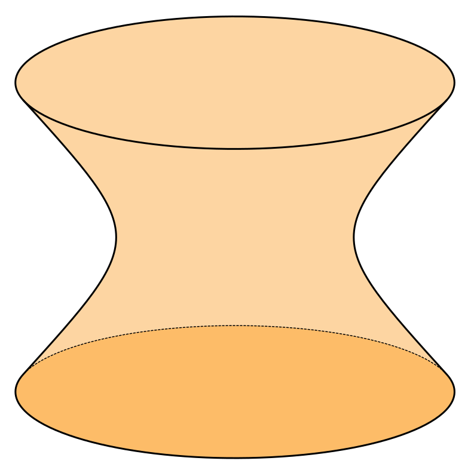

# Home
这里是 xzqbear 的数学笔记博客存放站，本站由 `mkdocs` 生成，现在仍然在更新当中.
## 关于我
{ align=left width="200" }
我是来自NKU的一名**数学系**大类学生，喜欢数学与技术，以下是联系我的一些方式：

- :material-mail: NKU邮箱(Email) ： `xzqbear@mail.nankai.edu.cn`
- :simple-github: Github 个人主页：[xiong-ZH-zq (xzqbear) (github.com)](https://github.com/xiong-ZH-zq)
  
这里的笔记内容主要是NKU数学类课程的课程笔记，参考的教材也不仅仅只局限于NKU使用的教材。

如果喜欢这个笔记存放站，欢迎给一个 Star :material-star: 或者 Fork :fontawesome-solid-code-fork: 这个仓库。

本站公式采用 $\mathrm{\LaTeX}$ 公式（具体一些是 KaTeX），同时绘图使用 TikZJax 或 Python 等工具导出. 相对复杂的图形一般用 Axglyph 手绘并转为 SVG 图像. 例如下图即为一个 SVG 图像.

{width="300"}