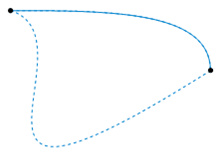
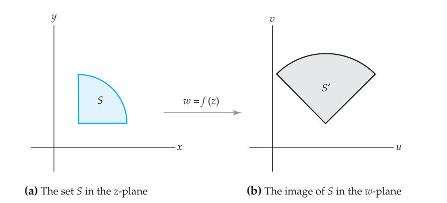
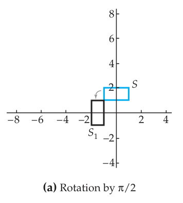
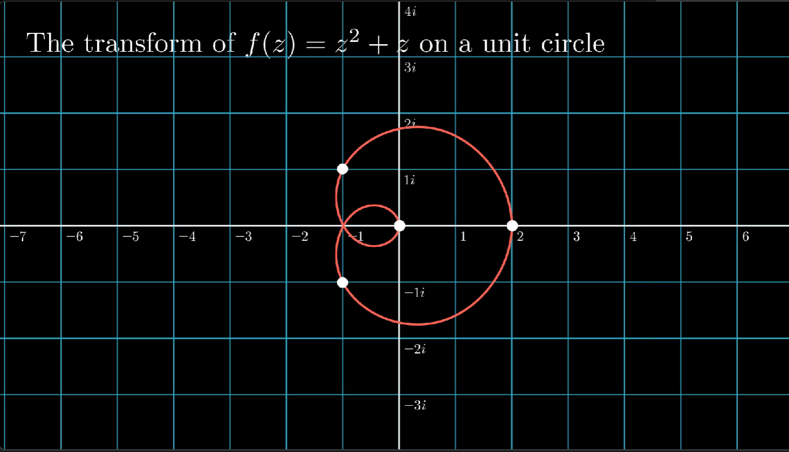

# 解析函数
## 一个复变量的函数

>[!note] 复变量函数（单复变函数）
>设集合 $D$ 定义在复数集上，若有一个规则 $f$ 使对每一个 $z\in D$ ，都有唯一的 $w\in \mathbb{C}$ 与之对应，即 $$ w=f(z),\ z\in D $$ 
>那么就称 $f$ 为**复变量函数**。其中 $D$ 为函数**定义域**，$f(D)$ 为函数的**值域**。

复变量函数实际上就是把原来的实变量函数定义域与值域都扩展到复数域上面得到的函数，对于这样的函数，如果将 $z,w$ 写为标准形式 $x+yi,u+vi$ ，有：
$$ 
w=f(z)=f(x+y\mathrm{i})=u+v\mathrm{i}
$$
我们可以写为 $f(x+y\mathrm{i})=u(x,y)+v(x,y)\mathrm{i}$ . 例如函数 $f(z)=z^2$ ，那么代入 $z=x+yi$ 就会有
$$ 
f(x+y\mathrm{i})=(x+y\mathrm{i})^2=x^2-y^2+2xy\mathrm{i}
$$ 
对应有 $u(x,y)=x^2-y^2,v(x,y)=2xy$ .

对复变函数，还有一个概念叫**多值函数**，也就是说如果对 $D$ 内每一个复数 $z$ 都有几个乃至无穷多个 $w$ 与之对应，那么就称 $f(z)$ 为**多值函数**。相对应的，在开头我们定义的函数叫**单值函数**.

多值函数的一个例子就是 $f(x)=\mathrm{Arg}z$ . 一个 $z$ 可以对应多个辐角，因此为多值函数. 注意其中的符号区别，$\mathrm{Arg}$ 表示所有的辐角，$\arg$ 则表示幅角主值，这点需要注意.
## 极限与连续
### 复函数极限定义
复数的函数极限可以说就是实数极限的简单推广，只不过将所有的绝对值理解为复数的模而已。简单写其定义如下（仅 $z\to z_0$ 有限极限情形）：

>[!note] 定义：复函数的极限
>若 $\forall \varepsilon>0,\exists \delta>0$ 当 $0<|z-z_0|<\delta$ 时有 $$ |f(z)-w_0|<\varepsilon $$ 
>那么就称 $f(z)$ 在 $z\to z_0$ 存在极限，记为 $$ \lim_{z\to z_0}f(z)=w_0 $$  

复函数极限实质上与实函数的二元情形较为类似，因为复变函数极限的 $z\to z_0$ 实际上是不限制方向的，这也从根本上使得实分析和复分析有所区别。

简单用定义证明下题 

>[!faq] 例题：用定义证明极限
>证明极限： $$ \displaystyle\lim_{z\to i}z^2=-1 $$  

考虑证明
$$ 
|z^2+1|<\varepsilon
$$ 
根据 $|z_1z_2|=|z_1||z_2|$ 有：
 $$ 
|z^2+1|=|z-\mathrm{i}||z+\mathrm{i}|<|z+\mathrm{i}|\delta
 $$ 
根据三角不等式，当 $|z-\mathrm{i}|<\delta$ 的时候，$|z-\mathrm{i}+2 \mathrm{i}|<\delta+2$ ，因此
$$ 
|z^2+\mathrm{i}|<\delta(\delta+2)=\delta^2+2\delta
$$
考虑令 $\delta^2+\delta<\varepsilon$ 成立，当 $\delta<1$ 的时候，取 $\displaystyle\delta=\frac{\varepsilon}{2}$ . 那么
 $$ 
\delta^2+\delta<2\delta<\varepsilon
 $$ 
因此证明成立。$\rule{3pt}{10pt}$

### 复函数极限性质

>[!note] 复函数极限的充要条件
>设 $w_0=u_0+iv_0,z_0=x_0+iy_0,w=f(z)=u(x,y)+iv(x,y)$ ，为使 $\displaystyle\lim_{z\to z_0}f(z)=w_0$ ，其充要条件为 $$ \lim_{(x,y)\to(x_0,y_0)}u(x,y)=u_0,\lim_{(x,y)\to(x_0,y_0)}v(x,y)=v_0 $$ 

充要条件用一句话来概括就是**实部和虚部极限对应相等**，注意极限是二重极限，所以在实际求解的时候要注意重极限的计算方法。

同样的，对应实函数极限的四则运算，复函数极限也有四则运算，且条件基本一致。
>[!example] 复函数极限的四则运算
>设 $\displaystyle\lim_{z\to z_0}f_1(z)=w_1,\lim_{z\to z_0}f_2(z)=w_2$ 那么有
>- 和函数的极限等于极限的和
>- 函数乘积的极限等于极限的乘积
>- 函数相除的极限等于极限相除（分母部分不能为0）

### 复函数连续

>[!note] 定义：复函数连续
>设 $f(z)$ 在 $z_0$ 处的一个邻域有定义，并且 $\displaystyle\lim_{z\to z_0}f(z)=f(z_0)$ 那么就称函数 $f(z)$ 在 $z_0$ 处**连续**。若在开域 $D$ 中的每一个点连续，就称函数 $f(z)$ 为在 $D$ 上的**连续函数**。

>[!example] 复函数连续的性质
>- 若相同的点处两个函数均连续，则和、差、乘积、商均为连续函数（商的部分要求分母部分函数取值不为0）。
>- 连续的充要条件是实部和虚部连续。
>- 复合函数连续。
>- 闭区域连续函数有界、有最值、一致连续。

这里的性质与多元微分部分基本能对应，证明也是用相同的方法，在此略过。

## 复函数的导数
### 复函数求导
>[!note] 复函数的导数
>复函数的导数 $f'(z)$ 定义为
> $$ \lim_{z\to z_0}\frac{f(z)-f(z_0)}{z-z_0}=f'(z_0) $$ 
>极限存在时亦称复函数**可导**或**可微**。

复变函数可导的定义形式上与实函数导数相同，在数学分析中学到的求导基本公式几乎都可以推广到复变函数上。

下面看一个简单的求导题：

>[!faq] 例题：复变函数求导
>设 $w=f(z)=|z|^2$ ，试对 $w$ 求导。

求导式如下：
 $$ 
\begin{aligned}
\frac{\mathrm{d}f}{\mathrm{d}z} &= \frac{|z+\Delta z|^2-|z|^2}{\Delta z}\\
&=\frac{(z+\Delta z)(\bar{z}+\overline{\Delta z})-z\bar{z}}{\Delta z}\\
&=z\cdot\frac{\overline{\Delta z}}{\Delta z}+\bar{z}+\overline{\Delta z}
\end{aligned}
 $$ 
如果 $\Delta z$ 为实数，那么上式趋近于 $z+\bar{z}$ ，如果是纯虚数，那么上式趋于 $-z+\bar{z}$ ，这说明只有 $z=0$ 的时候可导，且 $f'(0)=0$ . $\rule{3pt}{10pt}$

对于复变函数的可微性，一个有趣的地方是复变函数中处处连续又处处不可导的函数构造非常简单，例如 $f(z)=\bar{z}$ . 但是实变函数中这样的函数相对难找很多。
## 解析函数
### 解析函数的定义
>[!note] 定义：解析函数
>如果函数 $w = f(z)$ 在区域 $D$ 内可微，则称 $f(z)$ 为区域 $D$ 内的**解析函数**。也称为**全纯函数**或**正则函数**. 记为 $f\in H(D)$ .
>
>特别地，若函数 $f$ 在整个复平面上解析，则称 $f$ 为**整函数**.

>[!warning] 注意：解析函数的定义集合
>这个定义是定义在**区域**上的。如果说 $f(z)$ 在<u>某点</u>解析，意义是指 $f(z)$ 在该点的某一**邻域**内解析。如果说 $f(z)$ 在某<u>闭域</u>上解析，那么意义是 $f(z)$ 在包含 $\overline{D}$ 的**某区域**内解析。所以无论如何都是解析这个概念是定义于开集而非闭集。

>[!note] 奇点
>若函数 $f(z)$ 在 $z_0$ 处不解析，但在 $z_0$ 的某一邻域内总有 $f(z)$ 的**解析点**，则称 $z_0$ 为函数 $f(z)$ 的**奇点**。

也可见[[复级数与解析函数的幂级数表示法#孤立奇点|孤立奇点]]的定义.

解析函数是复变函数的**主要研究对象**，这在之后的学习中会逐渐体现出来。

### 解析函数的性质
>[!examples] 解析函数的性质
>- 解析函数的和差与乘积都是解析函数，商在分母不为 $0$ 的情形下也为解析函数；
>- 解析函数的复合（区域重合的部分）也是解析函数；
>- 开域中导数为 $0$ 的解析函数为常数 （由下文的 Cauchy-Riemann方程可证）.

我们常用**复微商**来刻画解析函数，设 $z = x+\mathrm{i}y,\overline{z} = x- \mathrm{i}y$ ，那么
$$
x=  \frac{1}{2}(z+ \overline{z}),\quad y = -\frac{\mathrm{i}}{2}(z-\overline{z}).
$$

若把 $f(x,y)$ 看成 $z$ 和 $\overline{z}$ 的函数求导有：
$$
f_z = \frac{1}{2}(f_x-\mathrm{i}f_y),\quad f_{\overline{z}} = \frac{1}{2}(f_x+ \mathrm{i} f_y).
$$

## Cauchy-Riemann方程

>[!note] Cauchy-Riemann方程
>设 $f(z)=u(x,y)+\mathrm{i}v(x,y)$ 定义在开域 $D$ 上，$z_0=x_0+\mathrm{i}y_0\in D$. 若 $f$ 在 $z_0$ 可导，则 $u$ 和 $v$ 在 $(x_0,y_0)$ 的**一阶偏导数存在**，并且在该点处有下面的方程 $$ u_x(x_0,y_0)=v_y(x_0,y_0),u_y(x_0,y_0)=-v_x(x_0,y_0) $$ 
>上面的方程称为 Cauchy-Riemann (C-R) 方程，此外  $$ \begin{aligned}f'(z_0)&=u_x(x_0,y_0)+\mathrm{i}v_x(x_0,y_0) \\\\ &=v_y(x_0,y_0)-\mathrm{i}u_y(x_0,y_0) \end{aligned} $$ 

对
$$
\lim_{z\to z_0}\frac{f(z)-f(z_0)}{z-z_0}
$$
取实轴方向的趋近和虚轴方向的两种趋近方式即可. $\rule{3pt}{10pt}$

C-R 方程的意义在于揭示了实部的实函数与虚部的实函数之间的关系，当 $f(z)$ 为解析函数的时候，该函数一定满足 C-R 方程，但是反过来不一定，也就是说满足 C-R 方程仅仅只是**必要条件**而非充要条件，充要条件由如下定理阐述：

>[!note] 定理：复变函数在某点可导的充要条件
>设 $f(z)=u(x,y)+\mathrm{i}v(x,y)$ 定义在开域 $D$ 上，$z_0=x_0+\mathrm{i}y_0\in D$. 则 $w=f(z)$ 在 $z_0$ 处的导数 $f'(z_0)$ 存在的**充要条件**是 $u$ 和 $v$ 在 $(x_0,y_0)$ **可微**而且在此点满足 C-R 方程。

由此 C-R 方程的意义在于，我们可以通过实部和虚部的实函数是否可微与满足 C-R 方程来判断函数是否解析。

同时，结合复微商，我们能知道如下的定理：
>[!note] 定理：解析的另一充要条件
>若 $u$ 和 $v$ 在开区域 $D$ 中可微，则 $f = u+\mathrm{i}v$ 在 $D$ 中解析的充要条件是 $$ \frac{\partial f}{\partial \overline{z}} = 0. $$

## 初等解析函数
### 多项式函数
实变函数当中的多项式函数概念可以直接搬过来，并且在复变函数中，它是性质较好的解析函数：
$$
f(z) = \sum\limits_{k=0}^n a_k z^k
$$
求导的法则也基本不变，所以在此不对其性质多加赘述。

### 有理函数
两个多项式 $P(z)$ 和 $Q(z)$ 的商 $\displaystyle\frac{P(z)}{Q(z)}$ 称为**有理函数**. 有理函数在其分母 $Q(z)$ 不为 $0$ 的所有点处都是解析的.

例如 $|\alpha|<1$ 时，Blaschke 因子
$$
f(z) = \frac{z- \alpha}{1-\overline{\alpha}z}.
$$
在闭单位圆 $|z|\leq 1$ 是解析的.
### 指数函数
>[!note] 定义：指数函数
>对于任何复数 $z=x+ \mathrm{i}y$ 我们用关系式
> $$ \mathrm{e}^z=\mathrm{e}^{x+\mathrm{i}y}=\mathrm{e}^x(\cos y+\mathrm{i}\sin y) $$ 来定义**指数函数**。
>

容易验证指数函数是解析函数.

>[!example] 指数函数的性质
>- 当 $z$ 为实数的时候定义与通常实指数函数一致；
>- $|\mathrm{e}^z|=\mathrm{e}^x>0,\arg \mathrm{e}^z=y,\mathrm{e}^z\neq 0$；同时需要注意的是 $\mathrm{e}^z$ 取实值的时候不一定为正数.
>- $\mathrm{e}^z$ 在 $z$ 平面上解析；
>- 加法定理成立，即 $\mathrm{e}^{z_1+z_2}=\mathrm{e}^{z_1}\mathrm{e}^{z_2}$；
>- $\mathrm{e}^z$ 是以 $2\pi \mathrm{i}$ 为基本周期的周期函数。
>- $\mathrm{e}^\infty$ 无意义；
>-  $\mathrm{e}^z$ 零点为 $2k \pi$.

复变函数中的指数函数已经不再代表 $\mathrm{e}$ 的乘方了，而仅仅只是一个记号，对应定义中的那个关系式。
### 三角函数与双曲函数
利用指数函数定义三角函数：
>[!note] 定义：复三角函数
> $$ \sin z=\frac{\mathrm{e}^{\mathrm{i}z}-\mathrm{e}^{-\mathrm{i}z}}{2\mathrm{i}},\cos z=\frac{\mathrm{e}^{\mathrm{i}z}+\mathrm{e}^{-\mathrm{i}z}}{2} $$ 分别称为 $z$ 的**正弦函数**和**余弦函数**。

>[!example] 复三角函数的性质
>- 正弦函数和余弦函数均在 $z$ 平面上解析，且 $$ (\sin z)'=\cos z,(\cos z)'=-\sin z $$ 
>- 遵从通常的三角恒等式 $$ \begin{cases}\sin^2z+\cos^2z=1\\ \sin(z_1+z_2)=\sin z_1\cdot\cos z_2+\cos z_1\cdot \sin z_2 \\ \cos (z_1+z_2)=\cos z_1\cdot \cos z_2-\sin z_1\cdot \sin z_2\end{cases} $$ 
>- 正弦和余弦函数仍然以 $2\pi$ 为周期。
>- $\sin z$ 的**零点**为 $$ z=n\pi(n=0,\pm1,\cdots) $$  $\cos z$ 的**零点**为 $$ z=\left(n+\frac{1}{2}\right),(n=0,\pm1,\cdots) $$ 
>- $\sin z$ 与 $\cos z$ 无界.

>[!warning] 复数域三角函数的模
>复数域内不能再断言 $|\sin z|\leq 1,|\cos z|\leq 1$ ，例如取 $z=\mathrm{i}y,y\in\mathbb{R^*}$ 时不成立。

除此之外，正切余切、正割余割都与实函数的定义类似，并且在分母不为零的点上均解析。双曲函数也类似。例如双曲正弦和双曲余弦：
$$
\sinh z= \frac{\mathrm{e}^z-\mathrm{e}^{-z}}{2},\cosh z = \frac{\mathrm{e}^z+\mathrm{e}^{-z}}{2}
$$ 
## 初等多值函数
在讨论多值性之前，先引入**单叶**的概念：

>[!note] 定义：单叶、单叶性区域
>设函数 $f(z)$ 在区域 $D$ 内有定义，且任意两个 $z_1,z_2(z_1\neq z_2)$ 都有 $f(z_1)\neq f(z_2)$ ，那么就称 $f(z)$ 在区域 $D$ 上是**单叶**的。$D$ 则被称为 $f(z)$ 的**单叶性区域**。

简单理解起来就是在区域内 $f(z)$ 为一个**单射**，在复变函数当中我们称其为单叶。利用单叶性区域的意义，我们往往可以用来解释为什么一个复变函数是多值的，下面来进行讨论。
### 辐角函数
我们知道任意一个复数有无穷多个辐角，因此 $w = \mathrm{Arg} z$ 为多值函数，对应了无穷多个值，且定义域为 $\mathbb{C}\backslash \{0\}$ （ $z=0$ 处的辐角无意义 ）

>[!note] 定义：曲线同伦
>若两条曲线的其中一条能逐点连续变化为令一条曲线，则称两条曲线**同伦**。

可以看以下的图例来直观理解同伦曲线的含义：

### 根式函数
我们规定**根式函数** $w=\sqrt[n]{z}$ 为**幂函数** $z=w^n$ 的反函数（其中的 $n$ 为大于1的整数）

对于根式函数，其多值性来源于辐角的多值性：
$$ 
w=\sqrt[n]{z}=\sqrt[n]{r}\mathrm{e}^{\mathrm{i}\frac{\theta+2k\pi}{n}}
$$ 
其中当 $k$ 发生变化时，就会出现多值性。我们有如下的表示：

>[!note] 定义：复变函数中的根式函数
> 复变函数中的根式函数定义为：
> $$ z^{\frac{1}{n}} =\sqrt[n]{|z|}\mathrm{e}^{\mathrm{i}\mathrm{Arg}(z)/n} $$

根式函数的主值取在辐角取主值的时候：
$$
\sqrt[n]{|z|}\mathrm{e}^{\mathrm{i}\arg(z)/n}
$$
此时的辐角主值范围限定为 $\displaystyle- \frac{\pi}{n}< \arg(z)\leq \frac{\pi}{n}$ . $\rule{3pt}{10pt}$

>[!faq] 例题：计算根值
>计算：$$ (-1+\mathrm{i})^{\frac{1}{2}} $$

代入公式有
$$
(-1+\mathrm{i})^{\frac{1}{2}} = \sqrt[4]{2}\mathrm{e}^{\frac{3}{8}\pi+k \pi}
$$
其中 $k\in \mathbb{Z}$ . $\rule{3pt}{10pt}$

同时我们还会把 $z^{\frac{1}{n}}$ 定义为 $z^n$ 的反函数，尽管 $z^n$ 可能不是一一映射，但是正如我们在实函数当中所做的，$\sin x$ 不是一一对应的，仍然有反三角函数 $\arcsin x$ ，就是因为我们限定了自变量的范围.

我们将根式函数限定在主值的范围内，也就可以称其为反函数了.
### 对数函数
>[!note] 定义：复对数
>我们规定对数函数是指数函数的反函数，即若 $$ \mathrm{e}^w=z(z\neq0,\infty)\tag{3.1} $$ 
>则复数 $w$ 称为复数 $z$ 的**对数**，记为 $w=\mathrm{Ln} z$.

它的多值性在哪？令 $z=r \mathrm{e}^{\mathrm{i}\theta},w=u+\mathrm{i}v$ ，那么有
$$
\mathrm{e}^{u+\mathrm{i}v}=r\mathrm{e}^{\mathrm{i}\theta}
$$
因此在取 $v$ 时，以 $2\pi$ 为周期均可取等，因此有
$$ 
u = \mathrm{Ln} r,v=\theta+2k\pi
$$
方程 (3.1) 的全部根为
$$
\begin{aligned}
\mathrm{Ln} z &= \mathrm{Ln} r+\mathrm{i}(\theta+2k\pi)\ (k=0,\pm1,\pm2,\cdots)\\\\
&=\mathrm{Ln}|z|+\mathrm{i}(\arg z+2k\pi)
\end{aligned}
$$ 
这说明一个复数的对数仍然是复数，而且实部为 $z$ 的模的通常实自然对数，虚部为 $z$ 的辐角.

为了限定一个值，记
$$ 
\ln z = \ln |z|+\mathrm{i}\arg z \ (-\pi<\arg z\leq \pi)
$$ 
此时 $\ln z$ 记为 $\mathrm{Ln}$ 的**主值**（支）. 在 NKU 的教材上，$\log z$ 在不特别说明的情形下，也理解为对数主值.

>[!example] 对数函数的基本性质
>- $\mathrm{Ln}(z_1z_2)=\mathrm{Ln} z_1+\mathrm{Ln} z_2$,
>- $\displaystyle\mathrm{Ln}\left(\frac{z_1}{z_2}\right)=\mathrm{Ln} z_1-\mathrm{Ln} z_2$.

基本性质的证明利用指数函数的运算性质即可。

>[!hint] 符号约定
>此处我们约定：首字母大写对应的函数是整个多值函数，小写字母则对应主值。
>
>刚刚的 $\mathrm{Ln}$ 和 $\ln$ 区别即在于此，后续的反三角也会如此表示.

### 一般幂函数与一般指数函数
现在我们来看一个容易混淆的问题：
>[!faq] 多个运算结果？
>计算
> $$ (8 \mathrm{i})^{\frac{2}{3}} $$

如果我们仍然以实数的计算方法来看，就会出现多个运算结果：
如果先算平方，那么就会出现：
$$
(8 \mathrm{i})^{\frac{2}{3}} = (-64)^{\frac{1}{3}} = -4
$$
这是个实值，但是如果先算根值：
$$
(8 \mathrm{i})^{\frac{2}{ 3}}=(2\mathrm{e}^{\mathrm{i}(\frac{1}{6}+\frac{2}{3}k)\pi})^2 
$$
这显然是多值的，那么出现了矛盾，我们应该如何计算？

上面的例子表明我们需要一个幂函数的良定义，对于一般的幂函数，即 $f(z)=z^a,a\in\mathbb{R}$ ，可用指数函数定义：
$$ 
z^a=\mathrm{e}^{a\mathrm{Ln} z}
$$

此时就可以直接归结到先前的对数函数讨论当中了，同时，非整数的幂都会出现多值性.

### 反三角函数
先从反正切函数开始，令
$$
w=\mathrm{Arctan}\,z
$$
我们可以将方程改写为
$$ 
z=\frac{1}{\mathrm{i}}\frac{\mathrm{e}^{\mathrm{i}w}-\mathrm{e}^{-\mathrm{i}w}}{\mathrm{e}^{\mathrm{i}w}+\mathrm{e}^{-\mathrm{i}w}}
$$ 
通分后可知为
$$ 
\mathrm{e}^{2\mathrm{i}w}=\frac{1+\mathrm{i}z}{1-\mathrm{i}z}
$$ 
因此取对数后有：
$$ 
\mathrm{Arctan}\,z=\frac{1}{2\mathrm{i}}\mathrm{Ln}\frac{1+\mathrm{i}z}{1-\mathrm{i}z}
$$ 
这就是反正切函数恒等式。我们可以定义其为复变函数的反正切函数.

>[!note] 定义：反正切函数
> 复变函数中的反正切函数为多值函数，定义为：
> $$ \mathrm{Arctan}\,z=\frac{1}{2\mathrm{i}}\mathrm{Ln}\frac{1+\mathrm{i}z}{1-\mathrm{i}z} $$ 

同理还有：
>[!note] 定义：反正弦函数、反三角函数
> 反正弦与反余弦函数定义为：
> $$ \mathrm{Arcsin}\,z=\frac{1}{\mathrm{i}}\mathrm{Ln}(\mathrm{i}z+\sqrt{1-z^2}) $$ 
> $$ \mathrm{Arccos}\,z=\frac{1}{\mathrm{i}}\mathrm{Ln}(z+\mathrm{i}\sqrt{1-z^2}) $$ 

## 可视化方法
>[!danger] 注意
>本部分主要关于复分析的可视化观点与实现，如仅仅只是应试，请跳过此节直接进入下一个笔记.

>[!quote] 参考书目
>[1] Dennis G.Zill,  *A First Course in Complex Analysis* . 
>
>[2] 特里斯坦尼达姆，《复分析：可视化方法》.

### 作为映射来看的复变函数
#### 映射观点
从如下的复变函数形式来看：
$$
f(x,y) = u(x,y)+\mathrm{i}v(x,y)
$$
如果想要实现它的可视化，那么直接绘图往往是行不通的，因为一个实函数我们需要二维的空间，但是对于两个实函数，此时我们要四维的空间，显然不能实现。

为了解决这个问题，我们改换视角，将其视为一个映射，它把一个复平面上的点映射为复平面上的点。更进一步，是将一个图形映为一个图形。

#### 图形的复数表达
为了方便几何上的讨论，我们往往将几何对象都以复数形式表达。

对于通过了复数 $z_0$ 和 $z_1$ 的直线，我们表达为：
$$
z(t) = z_0(1-t)+z_1t,t\in \mathbb{R}
$$
对圆，考虑
$$
z(t) = z_0+r \mathrm{e}^{\mathrm{i}t}
$$
更复杂的二次曲线在此不进行讨论。

#### 线性变换
下面来看 
$$
T(z)=az+b
$$
的变换效果，单独来看
$$
z+b,\ b\in \mathbb{C}
$$
这个部分，它代表的是对应点的平移，也就是整个图形的一个平移。例如，将点往右下角平移 $\sqrt{2}$ 个单位长度，就是 $z+(1-\mathrm{i})$ .

而对前面的 $a$ ，当 $a\in \mathbb{R}$ 的时候，可以认为就是**伸缩**，而 $|a|=1$ 且 $a\in \mathbb{C}$ 的时候，可以认为是**旋转**。

例如，对于四个端点为 $-1+\mathrm{i},1+\mathrm{i},1+2\mathrm{i},-1+2\mathrm{i}$ 的长方形，考虑线性变换 $f(z) = \mathrm{i}z$ ，那么就会是如下的旋转：

### 复导数
#### 共形性
考虑一个简单的解析函数映射：$f:z\to z^2$ . 我们记 $z=x+y \mathrm{i}$ ，那么
 $$ 
f(z) = (x^2-y^2)+2xy \mathrm{i} = u+v \mathrm{i}
 $$ 
由于 $u = x^2-y^2$ ，这就说明原来在 $x^2-y^2=C$ 这个双曲线上移动的点在映射之后会在 $uOv$ 坐标系当中沿着直线 $u = C$ 运动，对 $v = 2xy$ 也有同理。

我们定义两个曲线在交点处的夹角为两条**切线的夹角**，那么考察两条曲线和映射之后的两条直线的夹角，$u=C_1,v=C_2$ 显然正交，对两条曲线作隐函数求导有
 $$ 
\begin{aligned}
&x^2-y^2=C:y' = \frac{x}{y} \\
& 2xy = C: y' = -\frac{y}{x}
\end{aligned}
 $$ 
我们发现它们也是正交的！这也就是说变换**保角**，也称为共形性。

#### 平面映射的局部描述
下面我们来考虑从理论上解释这样的现象，我们用切线的方向向量来表示夹角，可以从下图来看：
{width="400"}
那么我们对于一个方向，我们可以用一个无穷小向量 $(\mathrm{d}x, \mathrm{d}y)^{\mathrm{T}}$ 表示，而映射之后的象则为 $(\mathrm{d}u,\mathrm{d}v)^{\mathrm{T}}$ ，也就是说可作全微分：
$$ 
\begin{aligned}
& \mathrm{d}u = u_x \mathrm{d}x+u_y \mathrm{d}y, \\
& \mathrm{d}v = v_x \mathrm{d}x+v_y \mathrm{d}y.
\end{aligned}
$$ 
那么我们可以发现我们可以用 Jacobi 矩阵来表示这样的一个过程，记 Jacobi 矩阵为 $\boldsymbol{J}$ ，那么有
$$ 
\begin{pmatrix}\mathrm{d}u \\ \mathrm{d}v\end{pmatrix} = \boldsymbol{J} \begin{pmatrix}\mathrm{d}x \\\\ \mathrm{d}y\end{pmatrix}
$$ 
这说明这样的映射就是一个**线性变换**！

如果我们再将之前的例子计算一次，就会发现
$$ 
\boldsymbol{J} = \begin{pmatrix}2x & -2y \\\\ 2y & 2x\end{pmatrix}.
$$
如果用极坐标简化就会发现
$$ 
\boldsymbol{J} = 2r\begin{pmatrix}\cos \theta  & -\sin \theta\\\\ \sin \theta & \cos \theta\end{pmatrix}
$$ 
这是一个旋转矩阵，也就不难推断它是**共形**的了。
#### 伸扭的概念
对于上述的映射，我们可以在几何上总结为：先伸缩，再旋转. 因此我们称为**伸扭**。伸缩的因子为**伸缩率**，扭转的角度为**扭转度**，我们以先前的变换为例，伸缩率为 $2r$ ，扭转度为 $\theta$ . 

#### 复导数的几何意义
对于实函数，导数的定义式的几何意义非常明确：
 $$ 
f'(x) = \lim_{\Delta x\to 0}\frac{f(x+\Delta x)-f(x)}{\Delta x}.
 $$ 
既然如此，我们将视角放在二维的平面上，也就有了一个几何上的观点，对于一个**无穷小**向量 $z$ ，在我们作用了 $f$ 之后，我们得到向量 $z'$ ，有
 $$ 
f'(z) \cdot z = z'.
 $$ 
按照伸扭的观点，$f'(z)$ 的长度必须为伸缩因子，而 $f'(z)$ 的辐角必须为旋转角. 在**解析函数**的背景下，这个条件是成立的.

考虑无穷小的向量 $\Delta z$ ，那么根据复变函数导数的定义式，有
 $$ 
f'(z) \Delta z = f(z+ \Delta z)-f(z).
 $$ 
由于 $\Delta z$ 的方向不限（这是复变函数可导决定的），因此对于一个**固定圆心的无穷小的圆**，解析函数**将这个圆映射为圆**. 但是对于各种大小的圆周它并不成立，仅针对微元圆周.

例如解析函数 $z^2+z$ 对于单位圆周的变换，可以看到它是不保持圆周的：

生成的动画代码见：

[Complex-Analysis-Visualization/Analytic Function/PolyminalTransform.py at main · xiong-ZH-zq/Complex-Analysis-Visualization (github.com)](https://github.com/xiong-ZH-zq/Complex-Analysis-Visualization/blob/main/Analytic%20Function/PolyminalTransform.py)

#### 从例子出发
>[!faq] 例1
>$f(z) = z+c$

这个函数表示对复数 $z$ 作平移 $c$ ，伸缩率为 $1$ ，且没有旋转，从而扭转度为 $0$ . 如果求导可以看到
 $$ 
(z+c)' = 1\cdot \mathrm{e}^{\mathrm{i}0}
 $$ 
这符合我们之前对导数几何意义的描述. $\rule{3pt}{10pt}$

>[!faq] 例2
>$f(z) = \overline{z}$.

这个映射不可能是解析的，我们可以从几何意义的角度来看，对于向量它并不是一个扭转，不同的向量将会旋转不同的角度，例如，对于角度为 $\varphi$ 的向量，它要旋转 $-2 \varphi$ 才能达到 $-\varphi$ ，从而旋转角度不同. $\rule{3pt}{10pt}$

### Cauchy-Riemann方程
我们再回到先前的 Jacobi 矩阵，并且将研究的函数改为任意的函数 $f(x,y) = u(x,y)+ \mathrm{i}v(x,y)$ .
我们考虑 Jacobi 矩阵：
$$ 
\begin{pmatrix}\mathrm{d}u\\ \mathrm{d}v\end{pmatrix} = \boldsymbol{J} \begin{pmatrix}\mathrm{d}x\\\\ \mathrm{d}y\end{pmatrix}.
$$ 
计算得到
$$ 
\boldsymbol{J} = \begin{pmatrix}\partial_x u & \partial_y u \\\\  \partial_x v  & \partial_y v\end{pmatrix}.
$$ 
我们发现一个事实：如果 $\boldsymbol{J}$ 是旋转矩阵，那么必须有如下的方程式成立：
 $$ 
u_x = v_y,u_y = -v_x.
 $$ 
这实际上就是 **Cauchy-Riemann 方程**！

实际上按照目前我们学习的逻辑而言，我们理应这么说：我们能在代数上严格证明 C-R 方程，进而在几何意义上，我们可以发现 $\boldsymbol{J}$ 是旋转矩阵.

再看 Jacobi 行列式，也就是 $|\boldsymbol{J}|$ ，它的值非常显然，也就是 $|f'(z)|^2$ ，因为它是旋转+伸缩的伸缩率，同时还因为是二阶矩阵，必须要加一个平方. 这个部分同时解释了 **NKU 教材习题2T16** 的几何意义.

