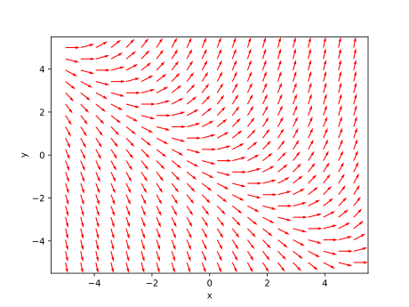

# 微分方程绪论
## 微分方程的基本概念
### 微分方程

>[!note] 定义：微分方程
>凡是含有自变量、未知函数与未知函数的导数（微分）的方程都课称之为微分方程。例如 $$ \frac{\mathrm{d}f(x)}{\mathrm{d}x}=f(x)+1 $$

微分方程中，未知函数最高阶导数的阶数称为微分方程的**阶数**。我们定义一个**线性**常微分方程的一般形式如下所示：

$$
a_n\frac{\mathrm{d}^nf}{\mathrm{d}x^n}+\cdots+a_1\frac{\mathrm{d}f}{\mathrm{d}x}+a_0f=y(x)
$$

其中 $y(x)$ 为已知的函数，满足上面条件的都称为**线性常微分方程**，否则均为非线性常微分方程。

对于一个微分方程的自变量个数，如果自变量个数为1，那么就称该微分方程为**常微分方程**，如果自变量个数有多个，就称为**偏微分方程**。

### 解和隐式解
对于一个微分方程，如果函数 $f(x)$ 代入该微分方程后能使其恒等，那么 $f(x)$ 就是该微分方程的**解**。
如果一个方程 $\Phi(x,y)$ 的隐函数 $y=\varphi(x)$ 是微分方程的解，那么 $\Phi(x,y)$ 就称为微分方程的**隐式解**。

### 通解和特解
#### 定义

>[!note] 微分方程通解
> 对于一个微分方程，含有 $n$ 个任意独立常数的解
> $$ y=\varphi(x,c_1,c_2,\cdots,c_n) $$
> 称为微分方程的**通解**。这里的“独立”表示下面的Jacobi行列式不为0：

$$
\begin{vmatrix}\frac{\partial\varphi}{\partial c_1}&\frac{\partial\varphi}{\partial c_2}&\cdots&\frac{\partial\varphi}{\partial c_n}\\ \frac{\partial^2\varphi}{\partial c_1^2}&\frac{\partial^2\varphi}{\partial c_2^2}&\cdots&\frac{\partial^2\varphi}{\partial c_n^2}\\ \vdots&\vdots&\ddots&\vdots\\\frac{\partial^n\varphi}{\partial c_1^n}&\frac{\partial^n\varphi}{\partial c_2^n}&\cdots&\frac{\partial^n\varphi}{\partial c_n^n}\end{vmatrix}
$$

同样地也可以定义隐式通解，这里不多赘述。

为了确定一个相对特定的解，我们往往给出一个**定解条件**来限定解。常见的定解条件为**初值条件**和**边值条件**， $n$ 阶微分方程的初值条件往往如下所示：
当 $x=x_0$ 时，有：
$$
y=y_0,\frac{\mathrm{d}y}{\mathrm{d}x}=y_0^{(1)},\cdots,\frac{\mathrm{d}^{n-1}y}{\mathrm{d}x^{n-1}}=y_0^{(n-1)}
$$
上面的 $x_0,y_0^{(0)},\cdots,y_0^{(n-1)}$ 都是已知的。

求微分方程满足定解条件的解的问题叫作**定解问题**，如果定解条件为初值条件，那么就称为**初值问题**。我们把满足初值条件的解称为**特解**，下面通过例子来进行对应。

考虑下面的微分方程：
$$
\frac{\mathrm{d}N}{\mathrm{d}t}=rN\tag{1}
$$
分离变量：
$$
\frac{\mathrm{d}N}{N}=r\mathrm{d}t
$$
然后进行积分可得：
$$
\ln N=rt+\bar{c}
$$
这里的 $\bar{c}$ 为任意常数，因此变形有：
$$
N = c\mathrm{e}^{rt}\tag{2}
$$
这里 $c = \mathrm{e}^\bar{c}$ ，我们把 (2) 称为 (1) 的通解，加入初值条件：当 $t=t_0$ 时， $N=N_0$ . 那么我们有特解：
$$
N(t)=N_0\mathrm{e}^{r(t-t_0)}
$$

#### 一阶微分方程解的存在性和唯一性

>[!note] 定理：存在性和唯一性定理
> 对一阶线性常微分方程 $$ \frac{\mathrm{d}y}{\mathrm{d}x}=f(x,y) $$
> 假设函数 $f(x,y)$ 在变量 $(x,y)$ 的平面 $P$ 上某一开集 $\Gamma$ 有定义，并且在整个开集 $\Gamma$ 上 $f$ 与 $\displaystyle\frac{\partial f}{\partial y}$ 在 $\Gamma$ 上都是 $x,y$ 的连续函数，那么定理断定：
> 1. （存在性）对于 $\Gamma$ 中的任一点 $(x_0,y_0)$ ，方程均有解 $\varphi(x)=y$ ，且满足 $$ y_0=\varphi(x_0) $$
> 2. （唯一性）如果 $y=\varphi(x)$ 和 $y=\psi(x)$ 都是该微分方程的解，那么只要它们在某一点 $x=x_0$ 上取值相等（$\varphi(x_0)=\psi(x_0)$），那么就有$\varphi(x)=\psi(x)$ .

需要注意的是唯一性的断言只在 $\varphi(x)$ 和 $\psi(x)$ 都有定义的区间上才是相等的，超出这个区间是没有办法保证相等的。

### 积分曲线与向量场

>[!note] 积分曲线
>一阶常微分方程 $$ \frac{\mathrm{d}y}{\mathrm{d}x}=f(x,y)\tag{3} $$ 的解 $\varphi(x)$ 表示 $Oxy$ 平面上的一条曲线，称为微分方程的**积分曲线**。

这里的一阶常微分方程是一个线性的一阶常微分方程都能自然导出的结果。积分曲线是**一族曲线**，如果给出一个初值条件使得：$\varphi(x_0)=y_0$ ，那么就具体到一条过点 $(x_0,y_0)$ 的具体曲线了。

每一点的曲线斜率就是 $f(x,y)$ 的对应取值，反之如果一条曲线的斜率处处都符合 $f(x,y)$ 的取值，那它就是积分曲线。可以用 $f(x,y)$ 在 $xOy$ 平面某区域 $D$ 上定义过各点的小线段的斜率方向，这样的 $D$ 称为微分方程 (3) 所定义的**方向场**或**向量场**。也可以用方向场定义相应的微分方程。例如下面的向量场定义了微分方程：
$$
\frac{\mathrm{d}y}{\mathrm{d}x}= x+y
$$

通过上面的存在性和唯一性定理，我们能断定对于一个特定的点 $(x_0,y_0)$ 有且仅有一条积分曲线通过。

