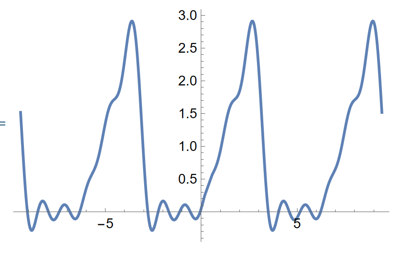
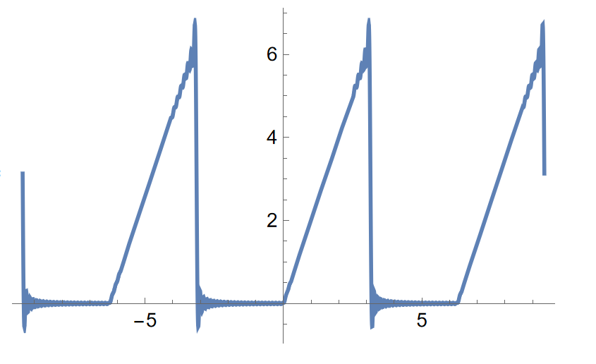

# Fourier级数与其应用
在 Taylor 级数当中，如果以线性代数的观点来看，对于 $f(x)$ ，有 Taylor 级数

$$
f(x)=\displaystyle\sum\limits_{n=0}^\infty a_n x^n
$$

这说明这样的 $f(x)$ 可以被这组基 $\{1,x,x^2,\cdots\}$ 线性表示. 

接下来的 Fourier 级数形如
$$
\frac{a_0}{2}+\displaystyle\sum\limits_{n=1}^\infty (a_n\cos nx+b_n \sin nx)
$$
也就是基为 $\{1,\sin x,\cos x,\sin 2x , \cos 2x,\cdots\}$ . 下面我们要研究的就是 Fourier 级数的存在性与性质.

## Fourier级数
### 三角函数系的正交性
Fourier 级数所处理的线性空间是由 $[a,b]$ 上所有**可积与绝对可积**的函数组成的，那么为了表示方便作如下约定：

- “可积”的含义是函数有界则为 Riemann 可积，函数无界则为广义积分收敛；
- “可积与绝对可积”表示 $f(x)$ 和 $|f(x)|$ 均“可积”.

从高等代数中，我们学习了**内积**的概念，定义可积函数 $f(x)$ 和 $g(x)$ 的内积为

$$
\int_a^b f(x)g(x)\mathrm{d}x
$$
那么不难验证其构成内积空间. 因此正交的概念就可以自然引出了：

>[!note] 定义：函数正交性
>设 $f(x)$ 和 $g(x)$ 在 $[a,b]$ 上**可积**，如果 $$ \int_a^b f(x)g(x)\mathrm{d}x=0, $$
>那么就称 $f(x)$ 和 $g(x)$ 在 $[a,b]$ 上**正交**，如果函数列 $\{f_n(x)\}$ 中的任意两个函数正交，则称这个函数列是一个**正交函数系**. 

现在考虑**三角函数系**：
$$
\{1,\cos x,\sin x,\cos 2x,\sin  2x,\cdots, \cos nx,\sin nx ,\cdots\}
$$
有如下定理：
>[!note] 定理1：三角函数系为正交函数系
>三角函数系为 $[-\pi,\pi]$ 上的一个正交函数系.

对于常数函数，有
$$
\int_{-\pi}^{\pi} \cos nx \mathrm{d}x = 0, \int_{-\pi}^{\pi}\sin nx \mathrm{d}x=0
$$
从而 $1$ 与所有的 $\sin nx$ 与 $\cos nx$ 都正交.
利用积化和差公式可以计算得出如下的结果：

$$
\begin{aligned}
&\int_{-\pi}^\pi \sin nx \cos mx \mathrm{d}x = 0\\
&\int_{-\pi}^\pi \cos nx \cos mx \mathrm{d}x = \pi \delta_{nm} \\
&\int_{-\pi}^\pi \sin nx \sin mx \mathrm{d}x = \pi \delta_{nm}.
\end{aligned}
$$

其中用到的 **Kronecker 符号** 
$$
\delta_{nm} = 
\begin{cases}
0,&n\neq m \\\\ 
1, &n = m.
\end{cases}
$$
故结论成立. $\rule{3pt}{10pt}$

进行上述的计算后有如下常用公式：

$$
\int_{-\pi}^{\pi} 1^2 \mathrm{d}x = 2\pi
$$

以及

$$
\begin{aligned}
\int_{-\pi}^\pi \cos^2 nx \mathrm{d}x = \pi \\
\int_{-\pi}^\pi \sin^2 nx \mathrm{d}x = \pi 
\end{aligned}
$$

### Fourier系数
设一个周期 $2\pi$ 的函数 $f(x)$ 在 $\mathbb{R}$ 上展开称为一致收敛的三角级数
$$
f(x) = \frac{a_0}{2}+\displaystyle\sum\limits_{n=1}^\infty(a_n \cos nx+ b_n \sin  nx).
$$
在 $[-\pi,\pi]$ 上逐项求积分得到
$$
a_0 = \frac{1}{\pi}\int_{-\pi}^\pi f(x)\mathrm{d}x.
$$
对于其他系数，我们根据上一节的正交性，对于 $\cos nx$ 的系数，我们可以乘上 $\cos nx$ 再逐项积分，对于 $\sin mx$ 也一致，从而有

>[!note] 定理：Euler-Fourier 公式
>$$\begin{cases}a_m =\displaystyle\frac{1}{\pi}\int_{-\pi}^\pi f(x)\cos mx \mathrm{d}x,m = 0,1,2,\cdots \\ b_n = \displaystyle\frac{1}{\pi}\int_{-\pi}^\pi f(x)\sin mx \mathrm{d}x, n = 1,2,3,\cdots\end{cases}$$

由于三角函数有界，上述积分一定有意义，将求出的 $\{a_n\}$ 和 $\{b_n\}$ 称为 $f(x)$ 的 **Fourier 系数**，并且记为
$$
f(x) \sim \frac{a_0}{2}+\displaystyle\sum\limits_{n=1}^\infty(a_n \cos nx+ b_n \sin  nx).
$$
此时不管右侧级数收敛域，也不管是否收敛到 $f(x)$ ，我们都称为 $f(x)$ 的 **Fourier 级数**.

同时，对于奇函数和偶函数，上述公式还可简化：
>[!note] 公式：奇函数与偶函数情形
>$f(x)$ 为偶函数时，$b_n=0,n=1,2,\cdots$ ，也就有 $$ f(x)\sim \frac{a_0}{2}+\displaystyle\sum\limits_{n=1}^\infty a_n \cos nx $$
> $f(x)$ 为奇函数时，$a_n=0,n=0,1,2,\cdots$ ，也就有 $$ f(x)\sim\displaystyle\sum\limits_{n=1}^\infty b_n \sin nx. $$


### Bessel不等式
>[!note] 定理：Bessel不等式
>设周期为 $2\pi$ 的函数 $f(x)$ 在 $[-\pi,\pi]$ 上可积和绝对可积，其 Fourier 系数 $\{a_n\},\{b_n\}$ 由 Euler-Fourier 公式给出，则
>$$ \frac{a_0^2}{2}+\displaystyle\sum\limits_{n=1}^\infty (a_n^2+b_n^2)\leqslant \frac{1}{\pi}\int_{-\pi}^{\pi}f^2(x)\mathrm{d}x. $$

纯计算：

$$
\begin{aligned}
&0\leqslant\frac{1}{\pi}\int_{-\pi}^{\pi}[f(x)-S_{n}(x)]^{2}\mathrm{d}x \\
&=\frac{1}{\pi}\int_{-\pi}^{\pi}\left[f(x)-\frac{a_0}{2}-\sum_{k=1}^{n}(a_k\cos kx+b_k\sin kx)\right]^2\mathrm{d}x \\
&=\frac{1}{\pi}\int_{-\pi}^{\pi}\left[f^2(x)+\frac{a_0^2}{4}+\sum_{k=1}^n(a_k^2\cos^2kx+b_k^2\sin^2kx)\right]\mathrm{d}x \\
&-\frac{1}{\pi}\int_{-\pi}^{\pi}\left[a_{0}f(x)+2\sum_{k=1}^{n}f(x)(a_{k}\cos kx+b_{k}\sin kx)\right]\mathrm{d}x \\
&+\frac{1}{\pi}\int_{-\pi}^{\pi}a_{0}\left[\sum_{k=1}^{n}(a_{k}\cos kx+b_{k}\sin kx)\right]\mathrm{d}x \\
&+\frac{1}{\pi}\int_{-\pi}^{\pi}2\left(\sum_{i=1}^{n}\sum_{k=1}^{n}a_{i}b_{k}\cos ix\sin kx\right)\mathrm{d}x \\
&+\frac{1}{\pi}\int_{-\pi}^{\pi}2\left[\sum_{i<k}(a_{i}a_{k}\cos ix\cos kx+b_{i}b_{k}\sin ix\sin kx)\right]\mathrm{d}x \\
&=\frac{1}{\pi}\int_{-\pi}^{\pi}f^2(x)\mathrm{d}x-\left[\frac{a_{0}^{2}}{2}+\sum_{k=1}^{n}(a_{k}^{2}+b_{k}^{2})\right].
\end{aligned}
$$

注意上式的 $i$ 不是复数 $i$ （在本笔记当中虚数单位 $\mathrm{i}$ 是正体而非斜体），令 $n\to \infty$ 即可证明不等式. $\rule{3pt}{10pt}$

如果不等式取等，就可以获得 Parseval 等式，在后续将会进一步阐述.


### Computer Lab
利用Mathematica计算Fourier系数并进行绘图可使用如下代码：
计算正弦系数可以利用如下代码：

```mathematica title="Mathematica"
FourierSinSeries[t/2, t, 5]
```
也就是以 $t$ 为自变量计算 $f(t)=\frac{t}{2}$ 的五项正弦系数，可得
```mathematica title="Mathematica"
Sin[t] - 1/2 Sin[2 t] + 1/3 Sin[3 t] - 1/4 Sin[4 t] + 1/5 Sin[5 t]
```

我们也可对运算结果直接绘图，对于前五项的 Fourier 系数：
```mathematica title="mathematica"
FourierSinSeries[t/2, t, 5] + FourierCosSeries[t/2, t, 5]
```

绘图有
```mathematica title="Mathematica"
Plot[%, {t, -3 Pi, 3 Pi}]
```

{width="300"}

如果更多项的话，可以绘制出更有意思的图像：

```mathematica title="Mathematica"
FourierSinSeries[t, t, 50] + FourierCosSeries[t, t, 50]
Plot[%,{t,-3 Pi, 3 Pi}]
```

{width="300"}

## Fourier级数的收敛性
### 部分和
将 Fourier 级数的部分和记为 $S_n(x)$ 并固定 $x_0$ ，利用 Euler-Fourier 公式有：

$$
\begin{aligned}
S_n(x_0) &= \frac{a_0}{2}+\sum\limits_{k=1}^n (a_k \cos k x_0+b_k \sin k x_0)\\
&= \frac{1}{\pi}\int_{-\pi}^{\pi}f(t)\left[\frac{1}{2}+\sum\limits_{k=1}^n (\cos kt \cos k x_0+\sin kt \sin k x_0)\right]\mathrm{d}t \\
&=\frac{1}{\pi}\left[\frac{1}{2}+\sum\limits_{k=1}^n \cos k(t-x_0)\right]\mathrm{d}t.
\end{aligned}
$$

由积化和差公式有
$$
2\sin\frac{\alpha}{2}\left(\frac{1}{2}\sum\limits_{k=1}^n \cos k \alpha\right) = \sin\frac{2n+1}{2}\alpha.
$$
当 $\sin \frac{\alpha}{2}\neq 0$ 时，得到

$$
\frac{1}{2}+\sum\limits_{k=1}^n\cos k \alpha = \frac{\displaystyle\sin\frac{2n+1}{2}\alpha}{2\sin \displaystyle\frac{\alpha}{2}}\tag{1}
$$

当 $\sin \frac{\alpha}{2}=0$ 时，设 $\alpha\in [-\pi,\pi)$ ，将上式理解为 $\alpha\to 0$ 时候的极限值，由于左侧连续，仍然成立。

从而我们计算得出
$$
S_n(x_0) = \frac{1}{\pi}\int_{-\pi}^\pi f(t)\frac{\sin\frac{2n+1}{2}(t-x_0)}{2\sin \frac{t-x_0}{2}}\mathrm{d}t
$$

为了探究收敛性，我们需要估计部分和与极限值之间的距离。
令 $u = t-x_0$ ，利用周期性，上式化为

$$
\begin{aligned}
S_n(x_0) &= \frac{1}{\pi}\int_{-\pi-x_0}^{\pi -x_0}f(u+x_0)\frac{\sin \frac{2n+1}{2}u}{2\sin \frac{u}{2}}\mathrm{d}u\\
&= \frac{1}{\pi}\int_{-\pi}^\pi f(u+ x_0)\frac{\sin \frac{2n+1}{2}u}{2\sin\frac{u}{2} }\mathrm{d}u\\
&=\frac{1}{\pi}\int_0^\pi[f(x_0+u)+f(x_0-u)]\frac{\sin\frac{2n+1}{2}u}{2\sin \frac{u}{2}}\mathrm{d}u
\end{aligned}
$$

对 (1) 积分可得

$$
\frac{1}{\pi}\int_0^\pi \frac{\displaystyle\sin \frac{2n+1}{2}u}{2\sin \displaystyle\frac{u}{2}}\mathrm{d}u=\frac{1}{2}
$$

把 $S_n(x_0)$ 可能的极限值记为 $S$ ，记

$$
\varphi(u) = f(x_0+u)+f(x_0-u)-2S
$$

则有

$$
S_n(x_0)-S = \frac{1}{\pi}\int_0^\pi \varphi(u)\frac{\displaystyle\sin\frac{2n+1}{2}u}{2\sin \displaystyle\frac{u}{2}}\mathrm{d}u
$$

为了使 $S_n(x)$ 收敛，有引理：
>[!note] 引理：Fourier级数收敛的充要条件
>设周期为 $2\pi$ 的函数 $f(x)$ 在 $[-\pi,\pi]$ 上可积和绝对可积，则 $f(x)$ 的 Fourier 级数在 $x_0$ 收敛到 $S$ 的充要条件是
> $$ \lim_{n\to \infty}\int_0^\pi \varphi(u)\frac{\displaystyle \sin \frac{2n+1}{2}u}{\displaystyle2\sin \frac{u}{2}}\mathrm{d}u=0. $$

### Cesaro和与Fejer定理
#### Cesaro求和


### 局部化定理
#### Riemann引理及其应用
>[!note] 定理：Riemann引理
>设函数 $f (x)$ 在区间 $[a,b]$ 上可积和绝对可积，则有
> $$ \begin{aligned}\lim_{\lambda\to +\infty}\int_a^b f(x)\sin \lambda x \mathrm{d}x=0 \\\\ \lim_{\lambda\to +\infty}\int_a^b f(x)\cos  \lambda x\mathrm{d}x=0 \end{aligned} $$

先证明第二个结论：
由于 $f(x)$ 在 $[a,b]$ 上绝对可积，因此 $f(x)$ 有界，故存在常数 $M$ 使得 $|f(x)|\leqslant M$ 成立. 

记 $n = [\sqrt{\lambda}]$ ，则当 $\lambda\to \infty$ 的时候 $n\to \infty$ 成立，考虑将区间 $[a,b]$ 作 $n$ 等分，分点为
$$
x_i = a+\frac{i}{n}(b-a) \quad (i=0,1,\cdots, n)
$$
记 $\omega_i$ 为 $f$ 在小区间 $[x_{i-1},x_i]$ 上的振幅，那么由于 $f$ 是可积的，所以有

$$
\lim_{n\to \infty} \sum\limits_{i=1}^n \omega_i \Delta x_i = 0,
$$

这里 $\Delta x_i = x_i-x_{i-1}$ ，注意到

$$
\left|\int_{x_{i-1}}^{x_i} \cos \lambda x \mathrm{d}x\right| = \frac{1}{\lambda}|\sin \lambda x_{i-1}-\sin \lambda x_i|\leqslant \frac{2}{\lambda}
$$

以及

$$
\begin{aligned}
&\int_a^b f(x)\cos \lambda x \mathrm{d}x = \\
 &\sum\limits_{i=1}^n\int_{x_{i-1}}^{x_i}(f(x)-f(x_{i-1}))\cos \lambda x \mathrm{d}x +\sum\limits_{i=1}^n f(x_{i-1})\int_{x_{i-1}}^{x_i}\cos \lambda x \mathrm{d}x
\end{aligned}
$$

从而利用有界性有

$$
\begin{aligned}
\left|\int_{a}^b f(x) \cos  \lambda x \mathrm{d}x\right|&\leqslant \sum\limits_{i=1}^n \omega_i \Delta x_i +\frac{2n}{\lambda}M \\
&\leqslant \sum\limits_{i=1}^n \omega_i \Delta x_i +\frac{2}{\sqrt{\lambda}}M\to 0
\end{aligned}
$$

从而 Riemann 可积的情形有 Riemann 引理成立.

----

再设 $f$ 在 $[a,b]$ 上反常绝对可积，不妨设 $b$ 是 $f$ 唯一的瑕点，那么对任意的 $\varepsilon>0$ ，存在 $\eta>0$ 使得
$$
\int_{b-\eta}^b |f(x)|\mathrm{d}x<\frac{\varepsilon}{2}.
$$
由于 $f$ 在 $[a,b- \eta]$ 上 Riemann 可积，此时根据刚才的结果可知存在 $\lambda_0>0$ 使得 $\lambda>\lambda_0$ 的时候有
$$
\left|\int_a^{b-\eta}f(x)\cos \lambda x \mathrm{d}x\right|<\frac{\varepsilon}{2}.
$$
于是当 $\lambda>\lambda_0$ 时，有
$$
\left|\int_a^b f(x)\cos \lambda x \mathrm{d}x\right|\leqslant \left|\int_a^{b-\eta}f(x)\cos \lambda x \mathrm{d}x\right|+\int_{b-\eta}^b |f(x)|\mathrm{d}x< \varepsilon
$$
上述不等式对于 $b= +\infty$ 的情形也成立，这就证明了 Riemann 引理在 $\cos$ 的情形下成立，对于第一个结论同理可证. $\rule{3pt}{10pt}$

>[!note] 推论
>设 $\{a_n\}$ 和 $\{b_n\}$ 为某个可积且绝对可积函数的 Fourier 系数，那么
>$$ \lim_{n\to \infty} a_n = \lim_{n\to \infty} b_n = 0. $$

下面应用 Riemann 引理计算积分：
>[!faq] 例题：Dirichlet积分
>证明：
>$$ \int_0^{+\infty} \dfrac{\sin x}{x}\mathrm{d}x = \frac{\pi}{2}. $$

利用等式：

$$
\frac{1}{2}+\sum\limits_{k=1}^n\cos kt = \frac{\displaystyle\sin\left(n+\frac{1}{2}\right)t}{\displaystyle2\sin\frac{t}{2}}
$$

两侧对 $t$ 在 $[0,\pi]$ 上积分，得到：

$$
\frac{\pi}{2} = \int_0^\pi \frac{\displaystyle\sin \left(n+\frac{1}{2}\right)t}{2\sin \displaystyle\frac{t}{2}}\mathrm{d}t.
$$

上式对于任意的 $n$ 均成立.

我们将上述的积分写为

$$
\begin{aligned}
&\int_0^\pi \frac{\displaystyle\sin \left(n+\frac{1}{2}\right)t}{2\sin \displaystyle\frac{t}{2}}\mathrm{d}t = \\
& \int_0^\pi \left(\frac{1}{2\sin (t/2)}-\frac{1}{t}\right)\sin \left(n+\frac{1}{2}\right)t \mathrm{d}t+\int_0^\pi \frac{\displaystyle\sin \left(n+\frac{1}{2}\right)t}{t}\mathrm{d}t.
\end{aligned}
$$

由于

$$
\lim_{t\to 0} \left(\frac{1}{2\sin(t/2)}-\frac{1}{t}\right) = 0
$$
可对右式第一个积分应用 Riemann 引理，从而可得趋于 $0$ ，因而有

$$
\lim_{n\to \infty}\int_0^\pi \frac{\displaystyle\sin \left(n+\frac{1}{2}\right)t}{2\sin \displaystyle\frac{t}{2}}\mathrm{d}t =\lim_{n\to \infty}\int_0^\pi\frac{\displaystyle\sin \left(n+\frac{1}{2}\right)t}{t}\mathrm{d}t \xrightarrow[~]{x = (n+\frac{1}{2})t}\int_0^{+\infty}\frac{\sin x}{x}\mathrm{d}x
$$

从而可得
$$
\int_0^{+\infty} \frac{\sin x}{x}\mathrm{d}x = \frac{\pi}{2}.
$$
从而命题成立. $\rule{3pt}{10pt}$


#### 局部化定理
利用 Riemann 引理，我们可以证明 Fourier 级数收敛的充要条件等价于
$$
\lim_{n\to \infty} \int_0^{\pi}\varphi(u)\frac{\displaystyle\sin \frac{2n+1}{2}u}{u}\mathrm{d}u = 0.
$$
这个由 Dirichlet 积分的推导过程即可得到，从而我们由如下的定理：
>[!note] 定理：局部化定理
>设周期为 $2\pi$ 的函数 $f(x)$ 在 $[-\pi,\pi]$ 上可积和绝对可积，则 $f(x)$ 的 Fourier 级数在点 $x_0$ 的敛散性仅由 $f(x)$ 在 $x_0$ 的任意小邻域内的值决定，它收敛到 $S$ 的充要条件是：存在 $0<\delta\leqslant \pi$ 使得
>$$ \lim_{n\to \infty}\int_0^\delta \varphi(u)\frac{\displaystyle\sin\frac{2n+1}{2}u}{u}\mathrm{d}u=0. $$

尽管 Fourier 系数需要依靠整个区间上的积分计算，但是 $S(x)$ 是否收敛到 $f(x)$ 仅由这个点上的 $f(x)$ 的性质决定.

### Dini判别法及其推论
>[!note] Dini判别法（Fourier级数）
>设周期为 $2\pi$ 的函数 $f(x)$ 在 $[-\pi,\pi]$ 上可积和绝对可积，对于点 $x_0$ 和实数 $S$ ，记 $\varphi(u)=f(x_0+u)+f(x_0-u)-2S.$ 如果存在 $0<\delta\leqslant \pi$，使得 $\displaystyle\frac{\varphi(u)}{u}$ 在 $[0,\delta]$ 上可积和绝对可积，则 $f(x)$ 的 Fourier 级数在 $x_0$ 处收敛到 $S$ .

根据 Riemann 引理可知
$$
\lim_{n\to \infty}\int_0^\delta \frac{\varphi(u)}{u}\sin\frac{2n+1}{2}u \mathrm{d}u = 0.
$$
再由**局部化定理**可得收敛. $\rule{3pt}{10pt}$


>[!note] 推论1：Lipschitz判别法
>设周期为 $2\pi$ 的函数 $f(x)$ 在 $[-\pi,\pi]$ 上可积和绝对可积，在点 $x_0$ 的左右极限都存在，又设存在常数 $L>0$，$\alpha>0$ 和 $0<\delta\leqslant \pi$ 使得当 $0\leqslant u\leqslant \delta$ 时有
>$$ |f(x_0\pm u)-f(x_0\pm 0)|\leqslant L u^\alpha $$
>即满足 $\alpha$ 阶 Lipschitz 条件.
>则 $f(x)$ 的 Fourier 级数收敛到
>$$ \frac{f(x_0+0)+f(x_0-0)}{2}. $$


>[!note] 推论2
>设周期为 $2\pi$ 的函数 $f(x)$ 在 $[-\pi,\pi]$ 上可积和绝对可积，如果 $f(x)$ 在 $x_0$ 可导或左、右导数都存在，则 $\displaystyle\lim_{n\to \infty}S_n(x_0)=f(x_0).$


### Dirichlet-Jordan判别法
>[!note] 引理：Dirichlet引理
>设 $\psi(u)$ 在区间 $(0,\delta]$ 上是递增函数，$\psi(0+0)=0$ ，则
>$$ \lim_{\lambda\to +\infty}\int_0^\delta \psi(u)\frac{\sin \lambda u}{u}\mathrm{d}u = 0. $$


>[!note] Dirichlet-Jordan 判别法
>设周期为 $2\pi$ 的函数 $f(x)$ 在 $[-\pi,\pi]$ 上可积和绝对可积，若存在 $\delta>0$，使得 $f(x)$ 在 $[x_0-\delta,x_0)$ 和 $(x_0,x_0+\delta]$ 上都单调或者在这两个区间中都可以表示成两个递增函数之差，则 $f(x)$ 的 Fourier 级数在 $x_0$ 收敛到
>$$ \frac{f(x_0+0)+f(x_0-0)}{2}. $$

Dirichlet-Jordan 判别法往往用于间断点的收敛值判断，如果间断点两侧为单调区间，那么很容易就能计算出这个点的收敛值.

## Fourier级数的逐项求积分和逐项求导
（本节均略去证明）
### 积分公式的拓展
>[!note] 定理：更一般的Newton-Leibniz公式
>设 $f(x)$ 为 $[a,b]$ 上的连续函数，除了有限个点之外处处可导，且 $f'(x)$ 在 $[a,b]$ 上可积，则如下 Newton-Leibniz 公式成立：
>$$ \int_a^b f'(x)\mathrm{d}x = f(b)-f(a). $$

>[!note] 定理：更一般的分部积分公式
>设函数 $f(x)$ 和 $g(x)$ 都在 $[a,b]$ 上可积和绝对可积. 记 $F(x) = \int_a^x f(t)\mathrm{d}t,G(x)=\int_a^x g(t)\mathrm{d}t$，则
>$$ \int_a^bf(x)G(x)\mathrm{d}x = [F(x)G(x)]\Bigg|_a^b - \int_a^b F(x)g(x)\mathrm{d}x. $$

### 逐项求导和逐项求积分
>[!note] 定理：逐项求积分
>设周期为 $2\pi$ 的函数 $f(x)$ 在 $[-\pi,\pi]$ 上可积和绝对可积，其 Fourier 级数为
>$$ f(x)\sim \frac{a_0}{2} +\displaystyle\sum\limits_{n=1}^\infty (a_n \cos nx +b_n \sin nx), $$
>则对任意的 $x\in (-\infty,+\infty)$ 都成立：
>$$ \int_0^x f(t)\mathrm{d}t = \frac{a_0x}{2} + \displaystyle\sum\limits_{n=1}^\infty \int_0^x(a_n \cos nt+b_n \sin nt)\mathrm{d}t. $$

这个定理相对较强，因为我们**无需知道** $f(x)$ **是否等于其 Fourier 级数**，只要可积与绝对可积，那么其原函数和 Fourier 级数相等.


>[!note] 定理：逐项求导
>设 $f(x)$ 是周期为 $2\pi$ 的**连续**函数，其 Fourier 级数为
>$$ f(x)\sim \frac{a_0}{2}+\displaystyle\sum\limits_{n=1}^\infty (a_n \cos nx+b_n \sin nx). $$
>如果 $f(x)$ 在 $[-\pi,\pi]$ 上除有限个点之外处处可导，且 $f'(x)$ 在 $[-\pi,\pi]$ 上可积和绝对可积，则对任意 $x\in (-\infty,+\infty)$ 成立
>$$ f(x)=\frac{a_0}{2}+\displaystyle\sum\limits_{n=1}^\infty (a_n \cos nx+b_n \sin nx). $$
>且 $f'(x)$ 的 Fourier 级数可由 $f(x)$ 的 Fourier 级数逐项求导得到，即
>$$ f'(x)\sim\displaystyle\sum\limits_{n=1}^\infty (nb_n\cos nx-n a_n \sin nx). $$


即 $f(x)$ 连续且除有限点外处处可导，$f'(x)$ 可积和绝对可积，那么 $f(x)$ 与其 Fourier 级数相等且可以逐项求导.


>[!faq] 例题：求级数的和
>求级数 $$ \displaystyle\sum\limits_{n=1}^\infty \frac{1}{n^2} $$
>的和.

对 $f(x) = |x|,-\pi\leqslant x\leqslant \pi$ 求 Fourier 级数，由 Dirichlet-Jordan 判别法可知级数收敛于 $f(x)$ .
则
$$
|x| =\frac{a_0}{2}+\displaystyle\sum\limits_{n=1}^\infty (a_n \cos nx+b_n \sin nx).
$$
可求得 $b_n = 0$ ，对于 $a_n$ 有

$$
\begin{aligned}
a_n  &= \frac{1}{\pi}\int_{-\pi}^\pi |x|\cos x \mathrm{d}x \\ 
&= \begin{cases}0,n\equiv 0\pmod{2}  \\  -\dfrac{4}{n^2\pi},n\equiv 1 \pmod{2}.\end{cases}
\end{aligned}
$$

因此
$$
|x| = \frac{\pi}{2}- \frac{4}{\pi} \displaystyle\sum\limits_{k=1}^\infty \frac{1}{(2k-1)^2}\cos (2k-1)x.
$$
令 $x = 0$ 即可得到
$$
\displaystyle\sum\limits_{k=1}^\infty \frac{1}{(2k-1)^2} =\frac{\pi^2}{8}.
$$
而
$$
\begin{aligned}\displaystyle\sum\limits_{n=1}^\infty \frac{1}{n^2} &= \displaystyle\sum\limits_{n=1}^\infty\frac{1}{(2n-1)^2}+\frac{1}{4}\displaystyle\sum\limits_{n=1}^\infty\frac{1}{n^2} \end{aligned}
$$
从而可以计算得级数为
$$
\displaystyle\sum\limits_{n=1}^\infty \frac{1}{n^2} = \frac{\pi^2}{6}.
$$
$\rule{3pt}{10pt}$


### Weierstrass第二逼近定理
>[!note] 定理：Weierstrass第二逼近定理
>设 $f(x)$ 为以 $2\pi$ 为周期的连续函数，那么对于任何 $\varepsilon>0$ 都存在多项式 
> $$ T_n(x) = \frac{a_0}{2}+\displaystyle\sum\limits_{n=1}^\infty (a_n\cos nx +b_n \sin nx). $$
>满足
>$$ |f(x)-T_n(x)|<\varepsilon,\forall x\in [0,2\pi]. $$

## Fourier级数的一致收敛性
>[!note] 定理：Fourier级数的一致收敛
>若 $f(x)$ 连续且分段光滑，则 $f(x)$ 的 Fourier 级数在 $(-\infty,+\infty)$ 上绝对收敛和一致收敛到 $f(x)$ .

